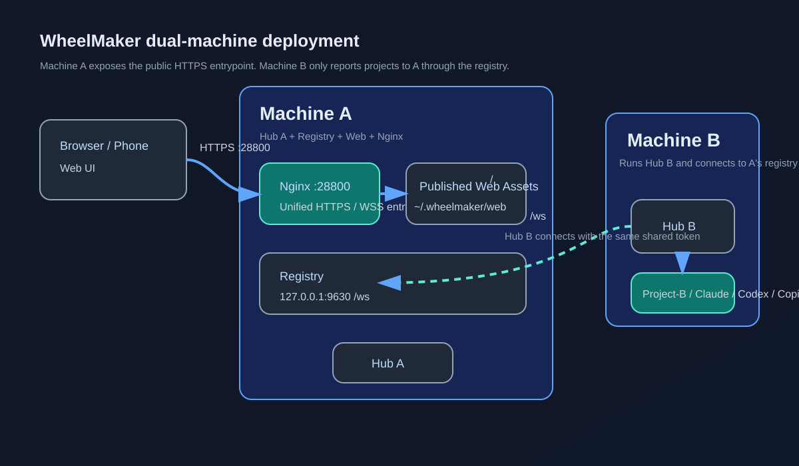
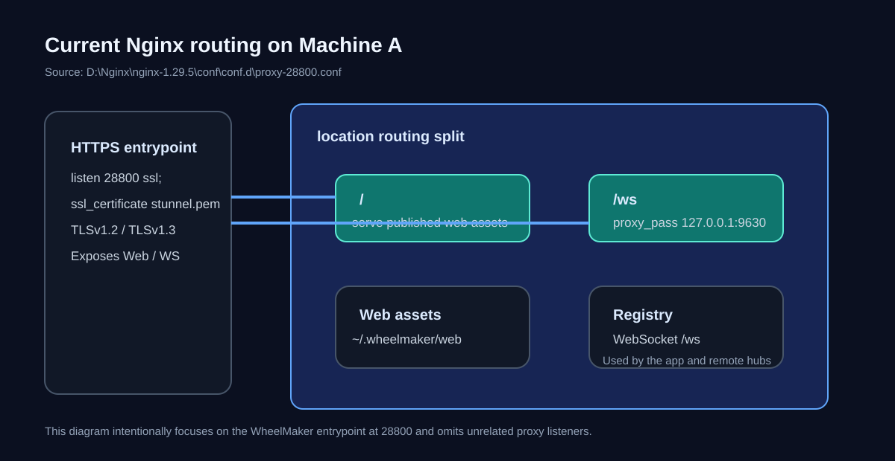

# WheelMaker

WheelMaker is a self-hosted daemon that lets you use AI coding workflows against your local repositories from a phone or a browser.

> Workspace Web UI / App -> WheelMaker -> Claude / Codex / Copilot -> your codebase

The supported trust and deployment boundaries are documented in [WheelMaker security model](docs/security.md); review the [known risks and deferred items](docs/security-known-risks.md) before exposing a Registry.



## Usage

### Deployment model

This README uses the current two-machine shape discussed for this repository:

- **Machine A**
  - runs one hub
  - hosts the registry service
  - publishes the Web UI
  - exposes a single HTTPS entrypoint through Nginx
- **Machine B**
  - runs another hub
  - reports its projects to Machine A through the registry
- **Clients**
  - browsers and phones connect to Machine A over HTTPS / WSS

This model works well when you want one machine to expose the public entrypoint while other machines only contribute projects and agents.

### Topology



### Entrypoints and ports

| Location | Endpoint | Purpose |
| --- | --- | --- |
| Machine A / Nginx | `https://<host>:28800/` | Web UI |
| Machine A / Nginx | `wss://<host>:28800/ws` | Registry WebSocket |
| Machine A / internal | `127.0.0.1:9630` | Registry listener |

### 1. Deploy the prebuilt release

The target machine does not need the WheelMaker source tree, Git, Go, npm, or a platform build toolchain. It needs:

- **Node.js 22+**
- `launchctl` on macOS, or `systemctl --user` on Linux
- Linux lingering enabled for the deploy user:

```bash
sudo loginctl enable-linger "$USER"
```

For either a new installation or a one-time migration from the old source deployment, copy the command for your platform from the public [wheelmaker-release README](https://github.com/swm8023/wheelmaker-release#install-or-migrate). It can run from any directory: it downloads the launcher to `~/.wheelmaker`, removes legacy services/programs when present while preserving user data, and installs the current stable release. No WheelMaker source checkout is required.

Every normal deploy replaces Hub and Web together. The resulting layout is:

```text
~/.wheelmaker/
  bin/                       # wheelmaker.exe or wheelmaker
  web/                       # complete Web release
  desktop/                   # optional WheelMakerDesktop.exe, updated separately
  staging/                   # update lock/status and verified temporary packages
  deploy.mjs
  deploy-core.mjs
  deploy.bat or deploy.sh    # normal deployment wrapper for the current platform
  release.json               # installed release schema v2
  config.json                # preserved across deploys
```

Normal deployment registers only current-user runtimes and does not require administrator privileges:

- Windows Scheduled Tasks: `WheelMaker` at logon and `WheelMakerUpdater` daily at 03:00.
- macOS LaunchAgents: `com.wheelmaker.hub` and `com.wheelmaker.updater` at 03:00.
- Linux systemd user units: `wheelmaker-hub.service` plus `wheelmaker-updater.timer` at 03:00.

The migration requests UAC on Windows only if legacy Windows Services actually exist. It also removes old tasks/HKCU Run values, updater/deploy/monitor executables, lifecycle wrappers that are no longer generated, and obsolete build/mobile/temp artifacts under `~/.wheelmaker`; it preserves `config.json`, databases, logs, Desktop, the active agent cache, and other user data.

`release.json` schema v2 records `version`, `publishedAt`, `sourceSha`, `manifestSha256`, and `installedAt`. App version reporting reads this file and public stable metadata; it does not infer the installed version from Git.

Manual deployment and lifecycle commands after deployment on Windows:

```powershell
~/.wheelmaker/deploy.bat
~/.wheelmaker/start.bat
~/.wheelmaker/stop.bat
```

`deploy.bat` pauses after Node exits so a double-clicked deployment keeps its result visible.

Manual deployment and lifecycle commands after deployment on macOS/Linux:

```bash
~/.wheelmaker/deploy.sh
~/.wheelmaker/start.sh
~/.wheelmaker/stop.sh
```

To update Desktop independently, close WheelMaker Desktop first and run:

```powershell
~/.wheelmaker/update_exe.bat
```

The stable release carries the latest available Desktop pointer, so a Hub/Web update can skip Desktop publishing without losing an older Desktop release. A running Desktop is never killed or replaced later on reboot; close it and retry.

The deploy scripts do not install or configure Nginx, Caddy, certificates, or public ports. Point your own reverse proxy at this contract:

| External path | Local target |
| --- | --- |
| `/` | static files from `~/.wheelmaker/web` |
| `/ws` | `http://127.0.0.1:9630` with WebSocket upgrade |

### 2. Configure Machine A

Edit:

```powershell
notepad ~/.wheelmaker/config.json
```

Example for Machine A:

```json
{
  "projects": [
    {
      "name": "WheelMaker",
      "path": "D:\\Code\\WheelMaker"
    }
  ],
  "registry": {
    "listen": true,
    "port": 9630,
    "server": "127.0.0.1",
    "token": "replace-with-shared-token",
    "hubId": "hub-a"
  },
  "log": {
    "level": "warn"
  }
}
```

Notes:

- `registry.listen: true` means Machine A hosts the registry server.
- `registry.port` is the internal registry port.
- `registry.token` is shared by trusted non-browser hubs and clients. Browsers authenticate through the Registry login endpoint and then use a session cookie.
- `registry.hubId` should be stable and recognizable, for example `hub-a`.

After signing in through the HTTPS page, configure DeepSeek, Volcengine ASR, and MiMo TTS under **Settings > Server**. A Key's presence determines whether its feature is available; there are no separate enable switches. These values are stored only on Machine A in `~/.wheelmaker/db/server-data.json`, with private file permissions and atomic replacement. The file contains plaintext secrets required at runtime, so protect its backups like credentials and never commit it.

Web and Desktop keep provider Keys on the server and use server-side speech/TTS providers. Android is the narrow exception: an authenticated APK receives only the Volcengine ASR credential, keeps it in process memory, and connects directly to Volcengine; it never persists that Key locally. Existing client-side Key settings are not migrated. Upgrade every client and re-enter the Keys in the Server section.

### 3. Configure Machine B

Machine B does not expose the public entrypoint. It only reports projects to Machine A.

```json
{
  "projects": [
    {
      "name": "Project-B",
      "path": "D:\\Code\\Project-B"
    }
  ],
  "registry": {
    "listen": false,
    "port": 9630,
    "server": "https://machine-a.example.com:28800",
    "token": "replace-with-shared-token",
    "hubId": "hub-b"
  },
  "log": {
    "level": "warn"
  }
}
```

Notes:

- `registry.server` can be `https://machine-a.example.com:28800`. WheelMaker will convert it to `wss://.../ws`.
- `registry.token` must match Machine A.
- `hubId` must be unique, for example `hub-b`.
- `listen: false` means Machine B does not host its own registry listener.
- Machine B does not need a copy of `server-data.json`; provider settings belong to the Registry entry machine.

### 4. Nginx + HTTPS example

The current local Nginx installation lives under:

```text
D:\Nginx\nginx-1.29.5\
```

The current routing file is:

```text
D:\Nginx\nginx-1.29.5\conf\conf.d\proxy-28800.conf
```

A deployment-oriented version of that setup looks like this:

```nginx
server {
    listen 28800 ssl;
    server_name _;

    ssl_certificate         D:/Nginx/cert/fullchain.pem;
    ssl_certificate_key     D:/Nginx/cert/privkey.pem;
    ssl_trusted_certificate D:/Nginx/cert/uca.pem;

    ssl_protocols TLSv1.2 TLSv1.3;

    root C:/Users/<YourUser>/.wheelmaker/web;

    location = / {
        try_files /index.html =404;
        add_header Cache-Control "no-cache, must-revalidate" always;
        add_header Content-Security-Policy "default-src 'self'; base-uri 'none'; object-src 'none'; frame-ancestors 'none'; script-src 'self'; connect-src 'self' wss: https://api.github.com https://raw.githubusercontent.com; img-src 'self' data: blob:; style-src 'self' 'unsafe-inline'; font-src 'self'; media-src 'self' blob:; worker-src 'self' blob:; form-action 'self'; upgrade-insecure-requests" always;
        add_header Referrer-Policy "no-referrer" always;
        add_header X-Content-Type-Options "nosniff" always;
        add_header X-Frame-Options "DENY" always;
    }

    location = /index.html {
        try_files /index.html =404;
        add_header Cache-Control "no-cache, must-revalidate" always;
        add_header Content-Security-Policy "default-src 'self'; base-uri 'none'; object-src 'none'; frame-ancestors 'none'; script-src 'self'; connect-src 'self' wss: https://api.github.com https://raw.githubusercontent.com; img-src 'self' data: blob:; style-src 'self' 'unsafe-inline'; font-src 'self'; media-src 'self' blob:; worker-src 'self' blob:; form-action 'self'; upgrade-insecure-requests" always;
        add_header Referrer-Policy "no-referrer" always;
        add_header X-Content-Type-Options "nosniff" always;
        add_header X-Frame-Options "DENY" always;
    }

    location = /service-worker.js {
        try_files /service-worker.js =404;
        add_header Cache-Control "no-cache, must-revalidate" always;
        add_header Content-Security-Policy "default-src 'self'; base-uri 'none'; object-src 'none'; frame-ancestors 'none'; script-src 'self'; connect-src 'self' wss: https://api.github.com https://raw.githubusercontent.com; img-src 'self' data: blob:; style-src 'self' 'unsafe-inline'; font-src 'self'; media-src 'self' blob:; worker-src 'self' blob:; form-action 'self'; upgrade-insecure-requests" always;
        add_header Referrer-Policy "no-referrer" always;
        add_header X-Content-Type-Options "nosniff" always;
        add_header X-Frame-Options "DENY" always;
    }

    location = /manifest.webmanifest {
        try_files /manifest.webmanifest =404;
        add_header Cache-Control "no-cache, must-revalidate" always;
        add_header Content-Security-Policy "default-src 'self'; base-uri 'none'; object-src 'none'; frame-ancestors 'none'; script-src 'self'; connect-src 'self' wss: https://api.github.com https://raw.githubusercontent.com; img-src 'self' data: blob:; style-src 'self' 'unsafe-inline'; font-src 'self'; media-src 'self' blob:; worker-src 'self' blob:; form-action 'self'; upgrade-insecure-requests" always;
        add_header Referrer-Policy "no-referrer" always;
        add_header X-Content-Type-Options "nosniff" always;
        add_header X-Frame-Options "DENY" always;
    }

    location ~* \.[a-z0-9]+$ {
        try_files $uri =404;
        add_header Cache-Control "public, max-age=31536000, immutable" always;
        add_header Content-Security-Policy "default-src 'self'; base-uri 'none'; object-src 'none'; frame-ancestors 'none'; script-src 'self'; connect-src 'self' wss: https://api.github.com https://raw.githubusercontent.com; img-src 'self' data: blob:; style-src 'self' 'unsafe-inline'; font-src 'self'; media-src 'self' blob:; worker-src 'self' blob:; form-action 'self'; upgrade-insecure-requests" always;
        add_header Referrer-Policy "no-referrer" always;
        add_header X-Content-Type-Options "nosniff" always;
        add_header X-Frame-Options "DENY" always;
    }

    location / {
        index index.html;
        try_files $uri $uri/ /index.html;
        add_header Cache-Control "no-cache, must-revalidate" always;
        add_header Content-Security-Policy "default-src 'self'; base-uri 'none'; object-src 'none'; frame-ancestors 'none'; script-src 'self'; connect-src 'self' wss: https://api.github.com https://raw.githubusercontent.com; img-src 'self' data: blob:; style-src 'self' 'unsafe-inline'; font-src 'self'; media-src 'self' blob:; worker-src 'self' blob:; form-action 'self'; upgrade-insecure-requests" always;
        add_header Referrer-Policy "no-referrer" always;
        add_header X-Content-Type-Options "nosniff" always;
        add_header X-Frame-Options "DENY" always;
    }

    location /ws {
        proxy_pass http://127.0.0.1:9630;
        proxy_http_version 1.1;
        proxy_set_header Upgrade $http_upgrade;
        proxy_set_header Connection "upgrade";
        proxy_set_header Host $host;
        proxy_set_header X-Real-IP $remote_addr;
        proxy_read_timeout 3600s;
        proxy_send_timeout 3600s;
        proxy_buffering off;
    }

}
```

In this layout:

- `/` serves the published Web UI assets
- `/ws` forwards to the registry WebSocket
- Existing Nginx files continue to work because `index.html` carries meta CSP/referrer protection, but full `frame-ancestors` and non-HTML coverage requires the four response headers in every static location above.

### 5. Build the Web UI locally

The Web build is published to:

```text
C:\Users\<YourUser>\.wheelmaker\web
```

Run:

```powershell
cd app
npm run build:web:release
```

This developer command will:

1. build the Web frontend
2. export the assets to `~\.wheelmaker\web`
3. refresh the local files served by the Nginx root path

Production releases do not use this as a conditional target-side step: the release builder compiles Web once, includes it in every platform archive, and every normal deploy replaces `~/.wheelmaker/web`.

### 6. Build releases locally

WheelMaker Android is a native Kotlin WebView shell under `mobile/android/`. It contains a dedicated bootstrap page where the user enters their HTTPS server Base URL, then loads the Workspace Web from that server. Changing servers clears state associated with the previous site.

Requirements:

- Android SDK with `ANDROID_HOME` or `ANDROID_SDK_ROOT`
- Gradle in `PATH`
- Node.js 22+

Run the unified interactive publisher from the repository root:

```bat
publish-release.bat
```

It asks whether to include Desktop, Android, and whether to publish publicly. All choices default to no. A local-only build still reads public `stable.json`, uses the next `v1.x`, and writes the same layout used for publication:

```text
.release-out/v1.x/
  wheelmaker-v1.x-windows-amd64/
  wheelmaker-v1.x-linux-amd64/
  wheelmaker-v1.x-darwin-arm64/
  desktop/                         # optional
  android/                         # optional
    WheelMakerAndroid.apk
    android-release.json
```

Reusable compiler state is kept separately from final output:

```text
.release-work/cache/
  webpack/
  go-build/
  go-mod/
  gradle/
.release-work/tmp/                 # removed after success or failure
```

Android `v1.x` maps directly to `versionName=1.x` and `versionCode=x`. Release signing reads the repository-owned `mobile/android/signing/signing.properties` and `release.p12`; release builds never fall back to the debug key. When Android is selected for a public release, the APK and manifest join the same GitHub Release and `stable.androidApk` is updated. Releases without Android carry the previous Android pointer forward. Host deployment ignores Android; the native Android Update screen downloads only the carried public pointer and verifies size, SHA-256, package identity, version, and signing identity before installation.

### 7. Install the Web UI as a PWA

WheelMaker Web already ships with:

- `manifest.webmanifest`
- `service-worker.js`
- `display: "standalone"`

So once the site is served over **HTTPS**, modern browsers can install it as a local PWA.

#### Open the app

1. Publish the latest Web build with `npm run build:web:release`.
2. Open `https://<host>:28800/` in a supported browser.
3. Wait until the page finishes loading once so the browser can discover the manifest and register the service worker.

If you open the site through plain HTTP instead of HTTPS, most browsers will not offer PWA install.

#### Install on desktop (Chrome / Edge)

1. Open `https://<host>:28800/`.
2. Look for the **Install app** / **Install WheelMaker** icon in the address bar, or open the browser menu.
3. Choose **Install**.
4. The app will be added locally and launch in a standalone window.

#### Install on Android

1. Open `https://<host>:28800/` in Chrome or Edge.
2. Open the browser menu.
3. Tap **Install app** or **Add to Home screen**.
4. Confirm the prompt.

After installation, WheelMaker can be launched from the app drawer or home screen like a native app.

#### Install on iPhone / iPad

1. Open `https://<host>:28800/` in **Safari**.
2. Tap the **Share** button.
3. Choose **Add to Home Screen**.
4. Confirm the app name and tap **Add**.

On iOS, the installed app opens from the home screen in a standalone-style window.

#### What to expect after installation

- the app opens without normal browser tabs
- the service worker keeps notifications available but does not persist the HTML/JS/CSS app shell
- app updates are picked up through the revalidated `index.html` on refresh or reopen
- local notifications and PWA-related capabilities can be enabled by the browser when supported

### 8. Service operations

Windows:

```powershell
~/.wheelmaker/start.bat
~/.wheelmaker/stop.bat
```

macOS/Linux:

```bash
~/.wheelmaker/start.sh
~/.wheelmaker/stop.sh
```

To restart the Hub manually, run `stop` and then `start`. Runtime and update status is reported by the Web UI from the Hub and `staging/status.json`; separate restart/status wrappers are not installed.

The scheduled and Web-triggered update flow is:

```text
validate stable -> acquire staging lock -> download -> verify SHA-256 -> stop Hub -> apply Hub + Web -> write release.json -> restart Hub
```

The Web UI requests an update by creating one atomic job in `staging/lock.json`; repeated clicks reuse the active job. `staging/status.json` exposes the current phase (`queued`, `downloading`, `verifying`, `applying`, `restarting`, `succeeded`, or `failed`). `node ~/.wheelmaker/deploy.mjs update` is the non-administrative updater entrypoint and never installs or removes runtime registrations.

### 9. Quick validation checklist

After deployment:

1. Open `https://<host>:28800/` and confirm the Web UI loads.
2. Confirm Machine B points `registry.server` at Machine A.
3. Confirm both machines use the same `registry.token`.
4. Confirm projects from multiple hubs appear in the UI.
5. Confirm the browser offers **Install app** / **Add to Home Screen** when opened over HTTPS.

### Chat commands

| Command | Description |
| --- | --- |
| `/use <agent>` | Switch the AI agent (`claude`, `codex`, `copilot`) |
| `/new` | Start a new session |
| `/list` | List saved sessions |
| `/load <id>` | Resume a saved session |
| `/cancel` | Cancel the current agent operation |
| `/status` | Show project and agent status |
| `/mode` | Toggle YOLO mode |
| `/model` | Switch agent model |
| `/help` | Show all commands |

## Features

### App workspace overview


The Web app is not only a chat panel. It is a remote workspace that combines project context, sessions, files, Git state, rendering, and connection recovery in one UI.

### 1. Chat and sessions


The app includes full session lifecycle management:

- create new sessions
- resume historical sessions
- switch between session threads
- reload a managed session immediately
- manage sessions across multiple agents
- show session-level config options

The chat view also supports:

- streaming output
- incremental session sync
- full-history hydration
- image attachments
- file link jumps directly from chat content

### 2. Projects and workspace aggregation

The app aggregates registry projects into one workspace view:

- multi-project switching
- project online/offline status
- current agent visibility
- project aggregation across multiple hubs
- direct entry into Chat / File / Git from the same shell

### 3. File browsing and reading

File support goes beyond opening a single text blob:

- directory tree browsing
- file open and cache reuse
- `notModified` short-circuit reads
- pinned files
- file scroll restoration
- file link navigation
- protection for large files and binary files

### 4. Git inspection

The Git view covers the workflows that matter most during remote inspection:

- current branch
- dirty state
- staged / unstaged / untracked summaries
- commit list
- commit file list
- commit diff
- working tree diff
- branch filtering and commit popovers

### 5. Rich rendering

The chat and code surfaces support rich content rendering:

- Markdown
- tables
- KaTeX math
- Mermaid diagrams
- syntax highlighting
- diff rendering
- theme, font, font size, line height, and tab size settings

### 6. Reconnect behavior and PWA support

The app includes behavior aimed at unstable mobile or backgrounded connections:

- silent reconnect
- keeping the workspace visible during reconnect
- on-demand session and file recovery
- PWA support
- local notifications
- service-worker-backed static asset caching

### 7. Settings and runtime visibility

WheelMaker also includes configuration and runtime visibility in the main app:

- runtime and registry address settings
- token provider and token stats, including DeepSeek token stats
- hub and registry project visibility
- stable version, release history, publish status, and active update job

## Repository structure

```text
WheelMaker/
  server/   — Go daemon (hub, agent adapters, registry)
  app/      — Workspace Web UI for browsers and WheelMaker Desktop
  docs/     — protocols, design docs, and README visual assets
  scripts/  — build, deploy, and update scripts
```

## Development

Server-side:

```powershell
cd server
go run ./cmd/wheelmaker
go test ./...
```

Web-side:

```powershell
cd app
npm test -- --runInBand
npm run tsc:web
npm run build:web:release
```

Release and script overview:

- `publish-release.bat` — interactively choose Desktop, Android, and public publication. It invokes the release MJS once and always writes `.release-out/v1.x`.
- `publish-release-action.bat` — verify the current clean commit is pushed, then interactively trigger the manual Action with the source SHA, Desktop choice, and Android choice.
- `node scripts/release.mjs [--with-desktop] [--with-android] [--publish]` — non-interactive equivalent; without `--publish` it builds the next public version locally.
- `.github/workflows/publish-release.yml` — manual `workflow_dispatch` fallback with a source `ref`, optional Desktop, and optional Android; Android setup is skipped when unused, Web builds once, and Hub binaries cross-compile for Windows amd64, Linux amd64, and macOS arm64.
- Public `wheelmaker-release` README command — download the launcher and perform a new install or one-time legacy migration from any directory.
- Installed `~/.wheelmaker/deploy.bat` / `deploy.sh` — platform wrapper for a normal `node deploy.mjs`; the Windows wrapper pauses when it finishes.
- Installed `~/.wheelmaker/update_exe.bat` — independently update `WheelMakerDesktop.exe` through the same stable SHA-256 chain.

Local publishing requires `gh auth login` and keeps the token returned by `gh auth token` only in the Node process. GitHub Actions publishing uses App secrets `WHEELMAKER_RELEASE_APP_ID`, `WHEELMAKER_RELEASE_INSTALLATION_ID`, and `WHEELMAKER_RELEASE_APP_PRIVATE_KEY`; the App is installed only on the public `swm8023/wheelmaker-release` repository. A release publishes and hashes all immutable assets before writing `stable.json` last. Release-repository write access is therefore the publication trust boundary.

## License

Private — all rights reserved.
