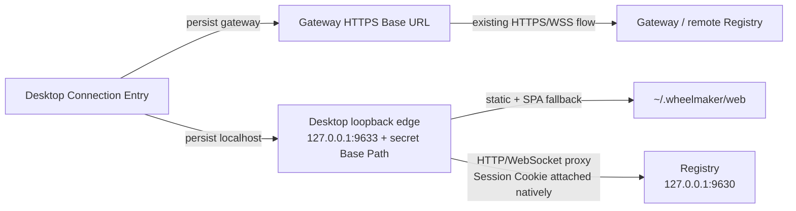

> 由 scope skill 于 2026-08-12 生成
> 状态：已批准 2026-08-12

# Desktop Localhost 连接模式

## 目标

为与 Hub/Registry 同机运行的 Windows Desktop EXE 增加独立的 Localhost 连接模式，使
Desktop 不读取 Hub 配置、不依赖 Gateway，即可通过固定本地 Origin 加载已安装的
Workspace Web 并连接本机 Registry。Localhost 继续使用现有 Token 登录与持久设备
Session，同时保持 Gateway/HTTPS 连接、Web 本地数据和 Hub/Registry 运行边界兼容。

## 决策基线

### 需求边界

- Desktop 连接入口提供 `Gateway` 与 `Localhost` 两种模式，由用户明确选择，并由 Desktop
  自己持久化当前选择；连接模式不由 Hub 配置推导。
- Gateway 模式继续要求并持久化 HTTPS Base URL，沿用现有远程探测、证书校验、导航、
  Session Cookie 和原生 Bridge 行为。
- Localhost 模式不要求填写地址，固定连接 `ws://127.0.0.1:9630` 的本机 Registry，并通过
  Desktop 自己的 `http://127.0.0.1:9633` 入口加载 Workspace。
- Localhost 只支持使用 canonical `~/.wheelmaker` 安装目录、与 Desktop 同一操作系统用户
  和同一台主机的 Windows Hub/Registry。自定义 Registry 端口、自定义 WheelMaker Home、
  LAN、普通浏览器、Android 和远程 Desktop 不在本模式范围内。
- Localhost 不安装、启动、停止或配置 Gateway；Gateway 和 Release-only Gateway 的现有
  生命周期保持不变。
- 部署流程不增加模式参数或配置写入。现有 `publicUrl` 为空、`registry.listen: true`、
  Registry 默认端口 `9630` 的配置已经满足服务端前置条件；如何维护该服务端配置仍属于
  现有部署/运维边界。
- Localhost 继续使用 Registry Token 登录。Token 只存在于登录请求期间，不由 Desktop
  持久化；登录成功后的设备 Session 跨 Desktop 重启保持有效，并继续遵循 Registry 现有
  撤销、过期和 Token 轮换语义。
- Localhost 使用固定 Origin `http://127.0.0.1:9633`。端口被占用、Web 资产缺失或
  Registry 不可达时明确失败并提供重试或重新选择连接模式，不静默改用动态端口、不自动
  回退 Gateway。
- Gateway Origin 与 Localhost Origin 的 localStorage、IndexedDB、Cache Storage 和其他
  站点数据相互独立，不迁移、复制或合并。Localhost 保持选择期间的重启和升级不改变其
  Origin；用户明确切换连接时沿用现有离开旧连接的登出与站点数据清理安全语义。
- Localhost 页面保留正式 Desktop 文件动作、窗口控制、更新、登录和进入 Local Dev 等
  合法原生能力；授权只属于精确的 Localhost 顶层页面。切换连接通过现有“修改服务器”入口
  返回连接选择页，Local Dev 的源码构建/进程控制仍只属于现有 Local Dev 模式。
- 不修改 Registry protocol version、Registry wire payload、Hub/Registry 认证模型、Session
  数据结构或 Registry/Hub 生产代码。

### 技术决策

- Desktop 配置是连接模式的唯一事实源。配置增加明确的 `connectionMode`，值只接受
  `gateway` 或 `localhost`；`baseUrl` 只属于 Gateway 模式。旧配置存在有效 `baseUrl` 且
  没有 mode 时迁移为 Gateway，空旧配置进入连接选择页，绝不通过读取
  `~/.wheelmaker/config.json` 自动选择 Localhost。
- 共享 Bootstrap/连接入口以 Desktop capability 决定是否显示 Localhost。Windows Desktop
  提供该 capability；Android 和其他壳继续只显示现有 Gateway URL 流程，不获得 Localhost
  行为。
- 选择 Gateway 时沿用现有 HTTPS URL 规范化、探测、保存和 trusted remote page 流程；
  选择 Localhost 时不收集 URL，原子保存 Desktop mode，启动 local edge 后导航固定本地
  Origin。失败时保留已选模式，让 Retry 重试同一 Localhost 启动，Change Connection 返回
  两种模式选择。
- Desktop 在 Localhost 下拥有一个进程内 HTTP edge：固定监听 `127.0.0.1:9633`，从
  `~/.wheelmaker/web` 提供静态文件与 SPA fallback，并将同一 Base Path 下的 `/ws` 子树
  代理到固定 Registry upstream `http://127.0.0.1:9630`，包括 WebSocket、认证、文件下载和
  HTML Preview 请求。
- Desktop 为本地入口生成并私密保存高熵 Base Path。HTTP listener 对该 Base Path 之外的
  请求 fail closed；固定 scheme/host/port 保证 Web Storage Origin 稳定，Base Path 同时
  降低普通本机浏览器误入和其他本地 HTTP 请求复用已认证入口的可能。
- Registry 返回的 Session Cookie 由 Desktop edge 捕获、校验并保存在当前用户专属的
  Desktop credential state 中，不转发给 WebView。后续认证 HTTP/WebSocket 请求由 edge
  向 Registry 附加该 Cookie；登出、Registry 返回未认证、Session 撤销、Token 轮换或离开
  Localhost 模式后清除本地 credential。
- Desktop credential state 只持久化恢复代理所需的 opaque Session Cookie、到期信息和
  Base Path secret，必须原子写入并沿用项目当前用户专属文件权限；Token 与 CSRF 不持久化，
  Token、Cookie、CSRF 和 Base Path secret 均不得进入 localStorage、URL query、日志或诊断。
- Web 构建生成专用于 Localhost 的入口 HTML，复用同一套正式 JS/CSS bundle。该入口允许
  同源 `ws:`，不启用 `upgrade-insecure-requests`，并保留其余正式 CSP、frame、script、
  object、referrer 和资源来源限制；Gateway 继续使用现有 HTTPS 入口 HTML。
- Desktop 增加独立的受信任 Localhost 页面状态。只有精确固定 Origin、私密 Base Path、
  顶层主 Frame 和成功提交的导航可以获得正式业务 Bridge；其他 path、iframe、旧导航、
  `file:`/`data:`/`javascript:`、Bootstrap 和 Local Dev 页面不得继承授权。
- 本变更明确替代“Desktop 不运行本地 Workspace 资源服务”的当前生产约束，但不恢复旧
  Embedded/Remote/Auto source fallback、不把 Web bundle 嵌入 EXE，也不复用已退休的
  `9632`。现有禁止 `9632`、禁止 `InsecureSkipVerify`、禁止非 loopback Registry 和禁止
  HTTP 远程 Base URL 的门禁继续成立。
- 不修改部署入口、`scripts/deploy/`、Hub 主配置 schema、Hub/Registry/Gateway/Android
  runtime 或 Registry 协议；Desktop Localhost 的全部状态与适配职责留在 Desktop 和 Web
  入口层。

## 设计视图

### 功能设计

Desktop 没有可用连接配置时显示连接入口。用户可以选择 Gateway，输入并验证 HTTPS Base
URL；也可以选择 Localhost，不输入地址而直接连接固定的本机服务。选择结果由 Desktop
持久化，后续启动直接恢复同一模式。旧版本已保存 Base URL 的用户无感继续进入 Gateway；
旧版本无 Base URL 的用户才看到新增的两种连接选择。

Localhost 启动时，Desktop 验证 `~/.wheelmaker/web`、占用固定 loopback 端口、恢复私密
Base Path 与设备 Session，然后加载本地 Workspace。首次进入或 Session 失效时，Workspace
显示现有 Token 登录界面。Registry 仍执行 Token 校验、限速和 Session 创建；Desktop
edge 只提供同源入口、代理请求并托管 Registry 返回的 Session Cookie。

用户关闭并重新打开 Desktop 时，固定 Origin、Base Path、Web Storage 和仍有效的 Registry
Session 被恢复，不需要再次输入 Token。Registry 拒绝 Session 时，Desktop 清理本地
credential并重新显示登录。Localhost 启动失败时保留模式与可诊断错误，Retry 重试固定入口，
Change Connection 返回 Gateway/Localhost 选择，不自动猜测其他端口或地址。

Localhost 页面中的“修改服务器”表示重新选择 Desktop 连接，而不是修改 Hub 配置。用户离开
当前连接时沿用既有 logout、credential 删除和 WebView 站点数据清理边界；两种 Origin 之间
不传递 localStorage、IndexedDB、Cache 或 Cookie。切换只改变 Desktop 自己的连接配置，
不启停 Hub、Registry 或 Gateway。

### 技术设计

#### 整体方案

Desktop connection config owns the branch before any Workspace navigation. Gateway remains the existing
remote path. Localhost edge is only the presentation and same-origin adapter for one Desktop process；它
不读取 Hub 配置、不成为新的业务服务或远程 Gateway。Registry 仍拥有 Token 校验、设备
Session、CSRF、WebSocket 角色和所有业务路由。

#### 关键结构

- **Desktop connection config**：`connectionMode` 是 mode 事实源；`baseUrl` 只在 Gateway
  分支使用。旧配置迁移是单向默认化，不读取或改写 Hub 主配置。
- **稳定 Localhost Origin**：固定 `http://127.0.0.1:9633`。高熵 Base Path 可独立于
  Origin 持久化，因此既限制入口又不影响同一模式内 Web Storage 的连续性。
- **本地 Web 来源**：使用标准安装已存在的 `~/.wheelmaker/web`，不把 Workspace bundle
  嵌入 Desktop 发布物。Localhost HTML 与 Gateway HTML 引用同一批内容哈希资产。
- **认证状态所有权**：Registry 继续拥有 Session 真相；Desktop 只保存 Registry 颁发的
  opaque Cookie。WebView 只持有 Registry 返回给页面的 CSRF 状态，不接触 Token 或
  Session Cookie。
- **Bridge 授权状态**：Desktop security state 区分 Bootstrap、Gateway Remote、Localhost
  和 Local Dev。Localhost 的业务 Bridge 绑定到精确 Origin/Base Path，不能由其他本机页面、
  子 Frame 或旧导航 epoch 复用。

#### 实现流程

1. Desktop 启动时只读取自己的配置。旧配置有合法 `baseUrl` 时默认化为 Gateway；已有
   `connectionMode` 时严格校验并恢复；没有选择时显示连接入口。
2. 连接入口根据 Desktop capability 展示 Gateway/Localhost。Gateway 继续走现有 URL 保存
   和 probe；Localhost 原子保存 mode，不写 `baseUrl`、Hub 配置或部署配置。
3. Localhost runtime 固定解析 Web 根与 `127.0.0.1:9630` upstream，加载或创建私密 Base
   Path 和本地 Session credential；不读取 `~/.wheelmaker/config.json`，也不探测 Gateway。
4. Desktop edge 在 `127.0.0.1:9633` 完成独占绑定并验证 Localhost 入口 HTML，再将带私密
   Base Path 的 URL 交给 WebView。静态请求只允许 Web 根内文件，未知客户端路由按 SPA
   规则回落；`/ws` 子树保持请求方法、Upgrade 和 Registry 专用响应头语义。
5. WebView 发起登录时，edge 按相同 Base Path 转发 Registry 请求。成功响应中的目标
   Session Cookie 被 native 层消费并持久化，响应 body 与非 Cookie 安全头返回页面。
6. 后续 status、logout、WebSocket、下载和 Preview 请求由 edge 附加当前 Cookie。Registry
   判定未认证或 logout 成功后，edge 清理 credential；临时网络失败不擅自销毁仍可能有效
   的 Session，但向页面返回可重试错误。
7. Desktop 正常退出时关闭 listener；下一次 Localhost 启动复用固定 Origin、Base Path、
   Web Storage 和仍有效的 Registry Session。端口无法绑定时保持失败态，不启动第二 Origin。
8. 用户请求修改连接时，Desktop 对当前连接执行现有 logout/清理，清除当前 mode 后返回
   连接入口。选择 Gateway 时关闭 Localhost edge并进入现有 HTTPS 流程；选择 Localhost 时
   不修改或管理任何后台服务。

### 预估改动面

- `server/cmd/wheelmaker-desktop/`：Desktop connection mode 配置迁移、Bootstrap capability
  与动作、Localhost loopback 静态/代理 edge、Session credential、固定 Origin 生命周期、
  WebView 导航和 Bridge 授权，以及现有“无本地资源服务”测试的目标行为更新。
- `app/web/`：生成 Localhost 专用入口 HTML/CSP并验证 Base Path、`ws:` 与正式 bundle
  复用；业务 Registry 客户端和 wire 协议保持不变。
- Desktop/Web 发布与安全验收测试：确保标准 WheelMaker Web 包含 Localhost 入口、Desktop
  EXE 仍不嵌入 Workspace bundle，并允许新的 `9633` loopback edge，同时继续禁止旧
  `9632`、非 loopback listener、HTTP 远程 Base URL、自签名绕过和凭据泄漏。
- 更新已确认的 `docs/wiki/architecture/gateway.md`，记录 Gateway remote entry 与 Desktop
  Localhost entry 的职责和互斥边界；不更新发布部署 Wiki。
- 不修改 `scripts/deploy/`、`server/internal/hub/`、`server/internal/registry/`、Gateway、
  Android runtime、Hub 主配置或 Registry protocol version。

## 验收

- **旧 Gateway Desktop 升级** → 只有有效 `baseUrl` 的旧 Desktop 配置被默认化为 Gateway，
  继续直接加载原 HTTPS 服务，不显示 Localhost、不读取 Hub 配置；Go 配置迁移和启动测试
  提供证据。
- **首次连接选择** → Desktop 连接入口同时提供 Gateway 与 Localhost；Gateway 要求 HTTPS
  URL，Localhost 不要求地址。选择后只更新 Desktop 私有配置；Bootstrap/bridge 测试验证
  状态与动作，源码检查验证没有 Hub 配置依赖。
- **Android 与非 Desktop 壳兼容** → 未声明 Localhost capability 时共享 Bootstrap 不显示、
  不调用或持久化 Localhost；现有 Android URL/Bootstrap 测试保持通过，无 Android runtime
  生产代码修改。
- **Localhost 启动** → 在现有 Hub/Registry 已按 `publicUrl` 空、Registry loopback `9630`
  运行时，Desktop 不需要 Gateway 即可显示 Workspace；Go Desktop HTTP/WebSocket 集成测试
  与 Windows smoke test 提供证据。
- **稳定 Origin** → 连续两次 Localhost Desktop 启动均使用
  `http://127.0.0.1:9633`，保持该模式期间已有 localStorage/IndexedDB 可见；WebView 测试或
  Windows smoke test 记录同一 Origin 的持久化证据。
- **固定 Registry 约束** → Localhost 只代理 `127.0.0.1:9630`，不读取 Hub config、不接受
  用户端口、不扫描其他端口；Go 构造与负向测试验证固定 upstream。
- **端口、资产或 Registry 失败** → `9633` 被占用、Web 根/index 缺失、路径逃逸或 Registry
  不可达时，Desktop fail closed、保留 Localhost mode、显示 Retry/Change Connection，且
  不选择随机端口或 Gateway；Go 负向测试覆盖。
- **仅本机 EXE 入口** → Desktop edge 只绑定 loopback，未知 Base Path 返回 404，LAN 地址
  和普通无 secret 请求不可用；HTTP 集成测试验证 bind、Host/path 边界和无 Gateway 依赖。
- **Token 首次登录** → Token 仍由 Registry 校验且不会持久化；Desktop 捕获 Session
  Cookie，WebView 不收到 `Set-Cookie`，认证后的 status 和 WebSocket 成功；代理集成测试
  使用真实 Registry handler 合同验证，但不修改 Registry 代码。
- **Session 跨重启** → 重启 Desktop 后受保护 credential恢复、Registry status 成功且不
  要求再次输入 Token；credential 文件权限、原子写入、日志脱敏和损坏文件 fail closed
  由 Go 测试验证。
- **Session 失效、登出与切换** → Registry 401、撤销、Token 轮换、logout 或离开 Localhost
  使 Desktop 清理 credential；修改连接返回模式选择并按现有规则清理旧 Origin，不在两个
  Origin 之间迁移数据；认证与 runtime 状态测试验证。
- **完整 Registry HTTP 合同** → 同一 Base Path 下 login/status/logout、WebSocket、文件
  下载和 HTML Preview 均经 Desktop edge 工作，Preview 自有 CSP/响应头不被静态路由覆盖；
  Go 代理集成测试和现有 Web Registry 测试提供证据。
- **Localhost Web 安全策略** → 本地入口加载正式内容哈希 JS/CSS，允许同源 `ws:`、不强制
  升级 HTTPS，并继续限制 script、frame、object、form 和非白名单 connect；Web 构建/CSP
  测试检查最终 HTML，Gateway HTTPS CSP 保持原样。
- **Bridge 隔离** → 只有 Localhost 精确 Origin/Base Path 的顶层已提交页面获得正式业务
  Bridge；随机 path、iframe、旧导航、危险 scheme、Bootstrap 和 Local Dev 均不能越权；
  Desktop policy/binding 测试提供证据。
- **部署零变化** → Localhost 功能不增加或修改部署参数、配置迁移和 Gateway 管理；相关
  Node 部署回归保持原样通过，diff/source gate确认 `scripts/deploy/` 无生产修改。
- **兼容边界** → Hub、Registry、Gateway、Android 和 Registry protocol 均无生产代码或
  wire version 变化；现有 Go/Web/Node 安全回归、Desktop 发布 WhatIf/产物检查及相关全量
  测试通过，仓库仍不包含 `:9632`、`InsecureSkipVerify` 或非 loopback Registry 放宽。
