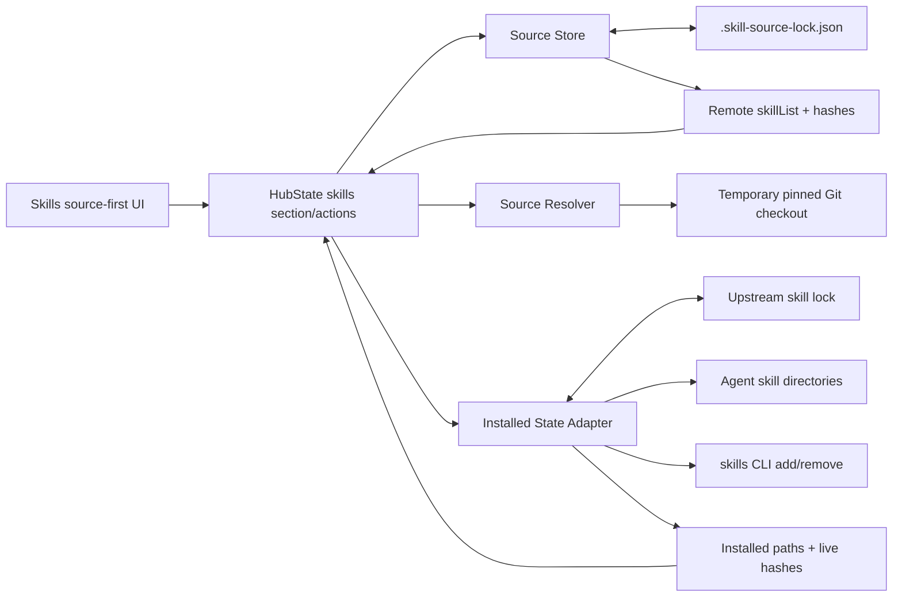

> 由 scope skill 于 2026-08-12 生成
> 状态：已批准 2026-08-12

# Skill Source Management

## 目标

将 WheelMaker 的 Skills 管理由“逐个展示已安装 skill、依赖上游 lock 推导更新”升级为以 Git source 为一级对象的目录管理：WheelMaker 持久化每个 source 最近一次成功解析的完整 skill 目录和内容 hash，用户可以显式刷新远端目录、查看未安装和已从远端删除的 skill，并且只在本地内容与当前远端快照不一致时执行精确更新。上游 `skills` CLI 仍负责实际安装、更新、卸载及原生 lock 维护，WheelMaker 不修改其 lock schema。

## 决策基线

### 需求边界

- Skills 页面以 scope 下的 source 列表为主信息架构。每个 Hub-global scope 和 Project scope 独立管理自己的 sources；未归属于任何配置 source 的本地 skill 显示在 `Unmanaged Skills`。
- source 是一个受支持的远端 Git 仓库及其单一 ref。同一 scope 内，同一规范化仓库最多存在一个 source；仓库地址创建后不可原地修改，ref 可以修改。更换仓库必须新增 source，再删除旧 source。
- 不引入 `all`、`selected`、`selectedSkills` 或额外的 skill 选择页面。source 始终保存并展示最近一次成功刷新得到的完整远端目录；skill 是否安装由本机原生 lock 和文件扫描确定。
- 裸 Git 地址只创建 source 并刷新目录，不自动安装任何 skill。直接 skill 地址以及包含 `--skill` 的受支持命令输入会归一化、创建或合并到对应 source，并在确认后安装输入中明确指定的 skills。
- 每个 scope 有独立的 `Show uninstalled skills` 开关，默认关闭。开关只影响当前客户端展示，不进入 source lock。关闭时仍显示已安装、远端已删除、冲突和错误项；开启后额外显示可安装的远端目录项。
- 页面打开只读取已保存目录和本地安装状态，不访问网络。远端读取只由显式 `Refresh`，或用户发起 Install、Update、Update All 前的强制刷新触发。
- 刷新成功后，新增远端 skill 自然成为未安装项；刷新失败时保留上次成功目录并显示 `Stale` 和错误，禁止依赖该快照执行 Install、Update 或远端删除判断。
- 本地 skill 目录在扫描时实时计算内容 hash，不保存本地安装 hash 或安装基线。远端和本地 hash 相等时显示 `Up to date` 且不显示 Update；不相等时显示 Update，并在执行前明确提示远端内容会覆盖当前本地内容。不区分差异是由远端更新、本地手改还是两者共同造成。
- 远端已不存在但本地仍安装的 skill 标红为 `Removed upstream`，只允许用户显式手动卸载。Update All 不自动卸载它，也不把远端新增项自动安装。
- 同一 scope 内，只要一个 skill 名称同时出现在多个 source，或者与 unmanaged 本地 skill 同名，所有对应 source skill 行都显示冲突、置灰且禁止逐项安装、更新、覆盖或卸载。用户通过删除冲突 source 或在 WheelMaker 外处理 unmanaged skill 来解除冲突；source 级删除仍可用。
- 单个 source 提供 Refresh 和 Update All；scope 提供 Update All Sources。Update All 只处理已安装、远端仍存在且本地/远端 hash 不同的 skills。批量操作先展示聚合预览，经确认后顺序执行，安装、更新、卸载采用 best-effort 并逐项汇总成功、失败、跳过和冲突，不回滚已经成功的项。
- 删除 source 时先展示其拥有的已安装 skills 并要求确认，然后卸载这些 skills。UI 发起的删除存在卸载失败时保留 source 和失败状态以便重试；没有已安装 skill 时可直接删除。
- 修改 ref 前必须成功获取目标 ref 的新快照并展示目录增删与内容变化；用户确认后才原子替换 ref 和目录快照。失败时保留原 ref 和原快照。
- Project source lock 随 Git 共享。来自 Git 的 source 新增或内容变化只改变可见目录/期望快照，不自动修改本机安装；来自 Git 的 source 删除在已有本地安装的机器上显示待确认移除，不自动卸载。
- 对只有上游原生 lock、尚无 WheelMaker source lock 的 scope 自动执行幂等迁移：按规范化远端仓库建立 sources，不改变当前安装内容。单仓库存在多个历史 ref 或多个不可等价安装地址时不得擅自选取，也不得写入歧义 source；这些安装由扫描结果合成为 `Needs resolution`，由用户明确地址/ref 后再建立 source。其余迁移 source 在首次成功刷新前显示 `Needs refresh`。
- 保持当前固定目标 agents、Hub-global 与 Project scope、Project `--copy` 安装方式、每 Hub 单一运行中写操作和 HubState 异步 operation 模型。此次不热刷新 agent provider registry。
- 不支持本地目录、`node_modules` 或无可验证远端 Git 来源的 source 管理；这些安装继续作为 unmanaged 或原生 CLI 管理项展示。

### 技术决策

- WheelMaker 使用独立的版本化 `.skill-source-lock.json`，不向上游 `.skill-lock.json` 或 `skills-lock.json` 写自定义字段：
  - Hub-global：与上游全局 lock 同目录；默认 `~/.agents/.skill-source-lock.json`，设置 `XDG_STATE_HOME` 时使用 `$XDG_STATE_HOME/skills/.skill-source-lock.json`。
  - Project：`<project>/.skill-source-lock.json`。
- source lock 是远端目录快照，不是本机安装数据库。每个 source 至少保存不可变安装地址、规范化仓库标识、ref、`resolvedCommit`、最后成功刷新时间和 `skillList`；每个 skill 至少保存 name、仓库内 `skillPath` 和整个 skill 目录的 `contentSha256`，可同时保存稳定展示所需的 plugin/category 元数据。
- `skillList` 只在完整拉取、发现、校验和 hash 全部成功后原子替换。列表与 sources 使用稳定排序和确定性 JSON 格式，减少 Project Git diff；损坏、未知 schema version、重复 source key 或无效字段不能被静默覆盖，必须报告可操作错误。
- Hub 负责用临时 Git checkout 解析 source、将 ref 固定为完整 commit、发现 skills 并计算远端目录 hash；上游 `skills` CLI 继续负责 add/remove 及其原生 lock。临时目录必须在成功、失败和取消后清理，不能把 App 提供的任意路径或命令透传给 shell。
- source lock 可能随 Project Git 公开或共享，因此 HTTP(S) source 地址不得包含 URL userinfo、访问令牌或其他内嵌凭据；合法的 SSH `git@host:path` 地址不属于该禁止范围。认证只复用 Hub 进程可用的外部 Git credential/SSH 环境，不把凭据写入 snapshot、operation result 或日志。
- `contentSha256` 使用跨平台一致的确定性算法：对 skill 根目录内允许的内容做边界安全遍历，排除 checkout 自身的 `.git` 元数据，使用规范化相对路径排序，并把无歧义的路径边界与原始文件字节共同纳入 SHA-256；不做换行、编码或空白归一化。逃出根目录的链接、不可读取文件或其他无法完整计算的内容使该远端 skill 无效，不能生成可操作快照。
- 本地状态从上游原生 lock、agent-visible 安装位置和实时目录 hash组合得出。固定 agents 的受管副本只有在所有预期可见副本均存在且内容与远端 hash 一致时才为 `Up to date`；任何缺失或内容差异都进入可更新/错误状态。WheelMaker 不持久化 `installedContentSha256`。
- Install 和 Update 必须使用 source lock 的 `resolvedCommit` 重新构造固定版本 source，并继续传递固定 agents、scope、Project `--copy` 和 `-y`。执行前强制刷新并要求用户确认刷新后预览，避免 branch 移动导致展示内容与实际安装内容不同；操作完成后重新扫描原生 lock 和本地 hash。
- source 归属以原生 lock 来源规范化后的 `sourceKey` 为稳定 identity，ref 变化不转移归属。ref 只用于远端快照与安装版本；存在 source lock 但来源无法唯一规范化的本地 skill进入 unmanaged。名称比较和冲突判断使用现有 skill 名称的大小写不敏感语义。
- Hub-local reconciliation metadata 只记录上次观察/应用的 source identity 和删除失败状态，用于在 Project source 被 Git 删除后跨重启恢复 `Pending removal`；它不保存远端目录副本或本地内容 hash，也不取代共享 source lock。新机器没有对应本地安装时无需生成待移除项。
- 所有 source lock 写入采用同目录临时文件、flush/close 后原子替换，并在写入前重新检查磁盘版本，避免刷新期间的外部 Git/UI 修改被静默覆盖。检测到并发变化时放弃本次写入、保留双方数据并要求重新刷新。
- source 目录、刷新错误、冲突、本地 hash 和 operation 结果通过现有 HubState `skills` section/action 边界传递。协议只做现有 section 内的增量结构扩展，不修改 Registry protocol version，也不恢复公开 `cmd.skills` 调用。
- 每 Hub 仍只允许一个改变 Skills 持久化状态的 operation。Refresh 不改变原生 lock 或 agent 目录，但会写 source lock，因此与 source 修改以及 Install、Update、Update All、Uninstall、source 删除共同进入受控异步 operation 生命周期；普通页面 scan 保持同步只读并可独立执行。
- UI 的 per-scope `Show uninstalled skills` 使用当前客户端本地状态，以稳定的 Hub/scope/Project identity 为 key；它不随 Project Git 共享，也不影响 Hub 返回的完整 source snapshot。

## 设计视图

### 功能设计

Skills 页面在每个 scope 下先展示 sources。source 行显示仓库、ref、最近一次成功刷新的 commit/time、已安装数量、可更新数量以及 `Needs refresh`/`Stale`/`Pending removal` 等状态。打开 source 后直接在同一详情 surface 展示目录行；默认过滤未安装的正常项，scope 开关打开后补充展示全部可安装项。

用户添加裸 Git source 时，WheelMaker 先验证和刷新远端，展示仓库、ref 和完整目录，确认后只保存 source。用户粘贴直接 skill 地址或受支持的 `npx skills add ... --skill ...` 文本时，WheelMaker 将其规范化到同一 source，仍展示完整目录，并在确认中单独列出本次将安装的明确 skills；若 source 已存在且 ref 一致，则合并使用现有 source identity，而不是创建重复条目；输入 ref 与现有 source 不同时必须引导到独立的 ref 修改预览，不能在安装动作中暗改 ref。

Refresh 只更新目录快照。成功后页面用新 `skillList` 与实时本地扫描组合出新增未安装、已是最新、需要更新、远端删除、冲突和错误状态；失败只更新运行态错误并保留旧目录。用户点击 Update 时只在 hash 不同且无冲突时可用，确认提示始终声明覆盖本地目录。Update All 和 Update All Sources 复用同一判定，只聚合当前已安装且 hash 不同的可操作项，不把目录变化解释为自动安装或自动删除。

用户手动卸载 `Removed upstream` skill 后，该项从本地安装集合消失；source 的当前远端目录不含该项，因此刷新后不再显示。删除 source 是独立的破坏性动作，确认对话框列出将卸载的本地 skills；逐项执行后报告结果，UI 删除只有在所属 skills 全部卸载成功后才移除 source，外部 Git 已删除 source 的失败项则保留为本地 `Pending removal` 状态。

### 技术设计

#### 整体方案

Hub 的 Skills 能力拆分为三个协作边界：Source Store 读写版本化 source lock；Source Resolver 在受控临时 checkout 中解析 ref、发现目录并计算 hashes；Installed State Adapter 复用原生 lock、agent 安装扫描和 `skills` CLI。HubState Skills adapter 把三者合成为完整 section snapshot，并把刷新、安装、更新、卸载和 source 生命周期动作路由到对应边界。Web 只消费结构化 snapshot 和 operation 结果，不解析 CLI stdout，也不自行读取 Project 文件。



Source Store 是远端目录快照的唯一持久化所有者；上游 lock 和文件系统是本机安装事实的所有者；HubState section 是 App 的唯一读模型。三者不互相复制职责。Project source lock 可提交到 Git，因此只承载跨机器有效的 source/ref/commit/catalog；UI 偏好、运行错误、删除重试和本机内容状态留在客户端或 Hub-local state。

#### 关键结构

source lock 的逻辑 schema 为：

```json
{
  "version": 1,
  "hashAlgorithm": "sha256-v1",
  "sources": [
    {
      "source": "https://github.com/example/skills.git",
      "sourceKey": "github.com/example/skills",
      "ref": "main",
      "resolvedCommit": "0123456789abcdef0123456789abcdef01234567",
      "refreshedAt": "2026-08-12T12:00:00Z",
      "skillList": [
        {
          "name": "example-skill",
          "skillPath": "skills/example-skill/SKILL.md",
          "contentSha256": "64 lowercase hexadecimal characters"
        }
      ]
    }
  ]
}
```

`source` 保留实际 fetch/install 所需且创建后不可变的地址；`sourceKey` 只用于同仓库去重和归属比较；`ref` 是用户选择的逻辑 ref；`resolvedCommit` 是本次目录快照和后续安装实际使用的不可变 commit。迁移生成的 source 允许 `resolvedCommit`、`refreshedAt` 和 `skillList` 为空，并据此进入 `Needs refresh`，但不能据此判断远端删除或提供 Install/Update。

组合后的 skill 行至少区分 `uninstalled`、`up_to_date`、`update_available`、`removed_upstream`、`conflict` 和 `error`。冲突和错误状态优先于普通安装状态；`removed_upstream` 只在最新 source 快照有效时产生。snapshot 同时携带操作可用性，而 Web 不根据字符串或颜色自行推导权限。

#### 实现流程

1. **读取与迁移**：Hub 扫描 scope 时读取 source lock。文件不存在则读取原生 lock，把可规范化的远端来源按 source key 聚合；地址/ref 唯一时以 `Needs refresh` source 原子写入，多地址或多 ref 时保留安装事实但不写歧义 source，并由读模型生成 `Needs resolution`，不可管理来源留在 unmanaged。已有有效 source lock 不重复迁移。
2. **刷新 source**：Hub 校验 source/ref，在临时目录 fetch/checkout，解析完整 commit，发现全部有效 skills，计算每个目录 hash并构造稳定排序快照。写入前确认源文件未被外部修改，成功后原子替换单个 source；任何阶段失败都保留旧快照并返回 `Stale` 错误。
3. **组合页面状态**：Hub 读取原生 lock 和 agent paths，对本地 skill 目录实时 hash；再以 source key、ref、skill name 和完整远端目录合并。之后进行 scope 级大小写不敏感同名检测，统一输出状态、原因和允许动作。
4. **安装指定 skill**：Add 输入解析出 source 与可选明确 skill names。裸 source 只走刷新和保存；明确 names 必须存在于刚刷新的目录且无冲突。用户确认后，以 `resolvedCommit` 执行受控 add，完成后重扫并返回逐项结果。
5. **更新**：Update/Update All 先刷新目标 source；scope 批量则依次刷新相关 sources。Hub 根据刷新后的目录和实时本地 hash生成预览，用户确认后只对 hash 不同的已安装项执行 pinned add。每项结束后继续下一项，最终统一重扫。
6. **远端删除与卸载**：有效刷新后，本地归属于 source 但 `skillList` 不再包含的名称成为 `Removed upstream`。只有用户点击该行 Uninstall 或确认删除整个 source 时才执行 remove；普通更新路径绝不把缺失项加入 remove runs。
7. **修改 ref**：先把候选 ref 解析为独立临时 snapshot，与当前 snapshot 生成预览；确认后以 compare-and-swap 方式写入新 ref/commit/list。取消、解析失败或文件并发变化均保持旧 source 完整不变。
8. **外部 Project 变更**：每次读取 Project source lock 时与 Hub-local 上次观察 identity 对账。新增/更新 source 立即改变目录读模型但不触发本机写操作；被删除且仍拥有本地安装的 source 生成 `Pending removal`，用户确认后 best-effort 卸载，失败状态跨重启保留。

### 预估改动面

- `server/internal/hub/tools/`：扩展 Skills command/domain，增加 source lock store、Git resolver、确定性目录 hash、迁移、组合状态、pinned install/update 和逐项 operation result；优先拆分现有大文件并延续 `tools_test.go` 中的现有测试承载约定。
- `server/internal/hub/`：扩展 HubState Skills section/action adapter 及本地 reconciliation metadata，保持现有 operation 发布和单写操作约束。
- `app/web/src/registry/`、`app/web/src/hubState/`：增加 source snapshot、skill 状态、预览和操作结果的结构化类型及 repository/service 入口，不恢复旧公开协议。
- `app/web/src/settings/`、`app/web/src/app/`、`app/web/src/shell/` 及相关样式：把 Skills 页面改为 source-first，增加 per-scope 未安装开关、source detail、状态行、刷新/更新/删除预览和 best-effort 结果展示。
- 现有 Go 与 Web 测试：覆盖 schema、迁移、原子写、Git/ref 解析、hash、冲突、stale、pinned operation、批量部分失败、UI 过滤和确认行为；不依赖真实公网 Git 服务完成单元测试。
- wiki：新建 `docs/wiki/features/skills-management.md`，更新 `docs/wiki/features/features.md` 索引及 `docs/wiki/architecture/hub-state.md` 的 Skills 状态所有权说明。
- Registry protocol version 保持不变；历史 ADR/spec 保留为历史记录，不回写成当前事实。

## 验收

- **Hub/Project source lock 归属** → Hub 和 Project 分别在约定位置生成 version 1 `.skill-source-lock.json`，不修改上游 lock schema；使用临时目录和单元测试验证路径选择、XDG fallback、确定性 JSON 和原子替换。
- **幂等迁移** → 只有原生 lock 的 scope 首次扫描后按规范化仓库建立 sources，安装目录与原生 lock 内容不变；单仓库多地址/ref 显示 Needs resolution 且不自动选择，重复扫描不产生新 diff，local/node_modules/无来源项保持 unmanaged。
- **完整显式刷新** → 成功刷新记录固定 commit、完整 skillList 和每项目录 hash；远端新增出现在未安装目录，远端删除使对应本地项标红；使用受控临时 Git fixture 覆盖分支移动、ref、嵌套支持文件和清理。
- **刷新失败安全性** → fetch、发现、非法路径、hash、写入或并发修改任一失败时保留旧 source lock 字节和旧目录，section 显示 Stale/错误，Install、Update 和删除推导不可用；故障注入测试验证无半写文件。
- **实时 hash 与 Update 可见性** → 远端目录与所有本地受管副本一致时不渲染 Update；修改任一 skill 文件、删除预期副本或改变远端内容后显示 Update；恢复一致后按钮消失。测试同时覆盖 `SKILL.md` 和 supporting files，且不读取持久化安装基线。
- **覆盖确认** → 所有 hash 不同的 Update 确认都说明会覆盖当前本地内容，不声称能区分本地修改或远端变化；组件测试验证文案和取消时零写入。
- **裸 source 与指定 skill 输入** → 裸仓库只保存完整目录且不调用 add；直接 skill 地址和 `--skill` 输入在 ref 一致时合并到同一 source，并只安装明确名称；输入不存在名称、既有仓库 ref 不同、重复仓库不同地址或冲突名称时给出结构化错误且不执行部分隐式安装。
- **固定快照安装/更新** → 分支在预览后移动也不会改变实际安装内容，CLI run 使用预览对应的 resolved commit、固定 agents、正确 scope 和 Project `--copy`；fake runner 断言参数并在完成后验证本地 hash。
- **Update All 边界** → source 和 scope 批量更新只包含已安装、远端存在、hash 不同且无冲突的 skills；未安装新增项与 Removed upstream 项不进入 runs；部分失败后其他项仍执行，结果逐项准确且最终状态重新扫描。
- **Removed upstream 手动处理** → 有效刷新后缺失项标红且只显示手动 Uninstall；Refresh、单项 Update 和任一 Update All 都不会删除它；手动卸载成功后该行消失，失败则保留错误状态。
- **同名冲突封锁** → 两个 sources 的大小写等价名称、以及 source/unmanaged 同名时，所有对应 source rows 均为 conflict 且安装、更新、覆盖、逐项卸载入口不可用；删除 source 入口仍可解除 source-source 冲突。
- **source 修改和删除** → ref 只有在候选快照成功、用户确认且 compare-and-swap 成功后改变；地址不可原地替换。UI 删除先列清单，全部卸载成功后删除 source，任一失败时 source 和逐项结果保留。
- **Project Git 外部变化** → 新增或更新的 source lock 被读取但不自动修改本地 agents；删除 source 且本机仍有其安装时产生可确认的 Pending removal，取消不卸载、失败可跨重启重试。
- **凭据边界** → 含 HTTP(S) URL userinfo、token query 或其他内嵌 secret 的 source 被拒绝，合法 SSH Git 地址仍可使用；Project source lock、HubState snapshot、operation error 和日志均不出现 Git 凭据。测试使用注入的 credential 环境验证 fetch 无需持久化 secret。
- **per-scope 展示开关** → 每个 Hub/Project 默认隐藏正常未安装项，切换一个 scope 不影响其他 scope；状态在当前客户端恢复但从不写入 Project source lock。冲突、Removed upstream 和错误项在关闭状态下仍可见。
- **协议与现有行为兼容** → App 只通过 HubState Skills section/actions 工作，Registry protocol version 不变；固定 agents、单写 operation、Project copy、operation 完成刷新和不热刷新 provider registry 的既有测试继续通过。
- **验证门槛** → 相关 Go tests、Web service/store/component tests、TypeScript typecheck 和 Web build 全部通过；测试使用本地 Git fixtures/fake runner，不要求公网或修改开发者真实 skill 目录。
