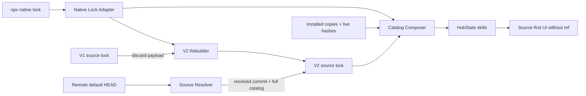

> 由 scope skill 于 2026-08-12 生成
> 状态：已批准 2026-08-12

# Skill Sources Follow the Default Branch

## 目标

将 Skill Source 从“仓库 + 可变 ref”简化为单一的远端仓库概念：所有目录刷新始终跟随远端广告的默认分支 `HEAD`，WheelMaker 内部不再接收、保存、展示或比较 ref。同时用无 ref 的 `.skill-source-lock.json` V2 重建已有 npx Skills 的 Source 归属，修复无 ref 原生 lock 被误判为 `Unmanaged` 以及多种异常被泛化显示为 `Error` 的问题。

## 决策基线

### 需求边界

- Source 始终表示某个规范化 Git 仓库的远端默认分支；“主干”指远端广告的 `HEAD`，不要求分支名必须是 `main`，也支持 `master` 或其他默认分支名。
- 用户不再看到 ref 输入、Apply/Change Ref 动作、ref 预览或相关确认文案。Source 仍显示最后成功刷新的短 commit SHA 和时间。
- 仅接受不指定 ref 的仓库输入。`repo#branch`、`repo#tag`、GitHub `/tree/<ref>/...` 地址以及携带 `ref` 的结构化命令请求都必须以可操作错误拒绝，不能静默忽略用户指定的版本。用户需先添加仓库，再从该 Source 的完整目录安装 Skill。
- `.skill-source-lock.json` V1 不做字段迁移。发现 V1 时废弃其全部 Source、ref、commit 和 skillList，仅根据当前 scope 的 npx 原生 `skills-lock.json`/`.skill-lock.json` 重新构造 V2。source lock 完全缺失时也走同一 V2 构造流程，以覆盖已有 npx Skills 但从未创建 WheelMaker source lock 的 scope。
- 仅存在于 V1、但没有任何已安装 Skill 可从原生 lock 还原的 Source 允许丢失，需要时由用户重新添加。重建不删除或改写任何已安装 Skill 目录。
- 原生 lock 中的 `ref` 字段无论缺失或存在都不参与归属。只要来源能规范化为唯一远端 Git 仓库，已安装 Skill 就归入对应 Source；本地路径、`node_modules` 或没有任何可验证远端来源的 Skill 仍为 `Unmanaged`。
- 由原生 lock 重建的 Source 在首次成功获取默认分支目录前显示 `Needs refresh`；该状态不得被显示为 `Error`，也不得据此推断远端删除或执行 Install/Update。
- 状态必须区分：待首次刷新为 `Needs refresh`，已有快照后远端刷新失败为 `Stale`，受管本地副本缺失或内容不一致为 `Copies differ`，不可读、越界或 hash 失败等真正无法建立状态的情况才显示 `Error`。
- 已有的 source-first 信息架构、每 scope 独立且默认关闭的 `Show uninstalled skills`、同名冲突禁用操作、远端删除标红、手动 Refresh/Install/Update/Uninstall 和 best-effort 批量语义保持不变。

### 技术决策

- `.skill-source-lock.json` 升为 version 2，`skillSourceSnapshot` 不再含 `ref`；保留不可变的 `source`、规范化 `sourceKey`、最后成功刷新的 `resolvedCommit`/`refreshedAt` 以及完整 `skillList`。每个 Skill 仍保存 `skillPath` 和确定性目录 SHA-256；本地 hash 仍在扫描时实时计算。
- V1 重建只读取其外层 version 用于识别，不使用任何 V1 Source 数据。Hub 先从原生 lock 在内存构造并验证完整 V2，再通过现有的 revision compare-and-swap 与同目录原子替换将 V1 覆盖。原生 lock 缺失时构造空 V2；原生 lock 存在但无法读取，或 V2 写入前磁盘 revision 变化时，保留原 V1 字节并报错，不留下缺失或半写文件。
- 从原生 lock 重建时，条目只按规范化 `sourceKey` 分组，不再要求 ref 非空、唯一或一致。同一仓库的等价 URL 与历史不同 ref 合并为一个 Source；真正不同的规范化仓库仍是不同 Source。WheelMaker 不回写 npx 原生 lock。
- Source Resolver 从远端广告的 `HEAD` 解析完整 commit，随后以 detached checkout 发现目录和计算 hash。无法解析远端 `HEAD` 时刷新失败，不回退猜测 `main` 或 `master`。临时 checkout 的安全边界与清理约束保持不变。
- Install/Update 仍使用最新成功刷新的 `resolvedCommit` 构造固定版本输入，保证预览、远端 hash 和实际安装内容一致；去掉的是用户可选逻辑 ref，不是不可变 commit pinning。
- Skills command payload、preview/result、HubState snapshot、Registry TypeScript 类型与 Web component props 都移除 `ref`，并删除 `changeRef` action 及相关状态流。服务端必须显式检测并拒绝输入边界上的旧 ref 参数，而不能依赖 JSON unknown-field 的静默丢弃。
- 不修改 Registry protocol version；Server 与 Web 作为同一 WheelMaker 版本同步发布。不恢复公开 `cmd.skills` 调用，不改变现有 HubState Skills section 的所有权和每 Hub 单一 Skills 写 operation 约束。
- 状态合成以 Source 快照、原生 lock 归属和本地实时 hash 为事实。`Copies differ` 在存在有效远端快照时可通过 Update 对齐到 `resolvedCommit`；在 `Needs refresh`/`Stale` 下不能使用未验证快照操作。泛化 `Error` 仅作为无法建立更精确状态的失败收敛。

## 设计视图

### 功能设计

Skills 页面仍在 Hub-global 和每个 Project scope 下展示 Source 卡片。卡片头部只显示仓库标识、最后 commit/time、Source 状态以及 Refresh/Update All/Delete 等现有动作；不再有 ref 输入或修改入口。Source 展开后继续展示最新成功刷新的完整目录，并由每 scope 的 `Show uninstalled skills` 控制是否展示未安装行。

添加 Source 时只输入仓库。Hub 解析远端默认 `HEAD`、生成候选目录并走现有确认流程。任何显式 ref 语法在进入远端解析或写 operation 之前被拒绝，错误文案说明 WheelMaker 始终使用默认分支，且不会忽略该 ref 继续操作。

升级后首次读取旧 scope 时，V1 被基于当前原生 lock 的 V2 原子替换；原本没有 source lock 的 scope 也直接从原生 lock 创建 V2。每个可归属仓库成为 `Needs refresh` Source，其原生 lock 中的已安装 Skills 显示在该 Source 下，不再因 ref 缺失显示为 `Unmanaged`。完成 Refresh 后，完整远端目录与实时本地 hash 重新合成 `Uninstalled`、`Up to date`、`Update available`、`Copies differ`、`Removed upstream`、`Conflict` 或真正的 `Error`。只有确实需要对齐且快照可用的行显示 Update。

### 技术设计

#### 整体方案

Source Store 以 V2 为唯一当前 schema；Native Lock Adapter 读取 npx 安装事实并按 `sourceKey` 合成归属；Source Resolver 仅解析远端 `HEAD` 和完整 commit；Catalog Composer 把 V2 快照、原生 lock 和本地副本 hash 组合为 HubState。Web 只消费结构化状态和动作可用性，不再维护 ref 本地状态。



#### 关键结构

V2 逻辑 schema 为：

```json
{
  "version": 2,
  "hashAlgorithm": "sha256-v1",
  "sources": [
    {
      "source": "https://github.com/example/skills.git",
      "sourceKey": "github.com/example/skills",
      "resolvedCommit": "0123456789abcdef0123456789abcdef01234567",
      "refreshedAt": "2026-08-12T12:00:00Z",
      "skillList": [
        {
          "name": "example-skill",
          "skillPath": "skills/example-skill/SKILL.md",
          "contentSha256": "64 lowercase hexadecimal characters"
        }
      ]
    }
  ]
}
```

`resolvedCommit`/`refreshedAt` 为空且 `skillList` 为空表示由原生 lock 重建但尚未刷新的 Source。V2 中出现 `ref` 属于非法数据，不得作为兼容字段重新引入。

#### 实现流程

1. **读取与重建**：读取 source lock envelope。V2 走正常校验；V1 忽略 payload，读取原生 lock，按规范化仓库分组构造无快照 Source，验证后 CAS 原子替换为 V2；source lock 缺失时以同样的原生 lock 分组生成 V2。未知高版本继续拒绝，不得以空 V2 覆盖。
2. **原生归属**：Native Lock Adapter 保留解析 `source`/`sourceUrl`、安装名称和路径的能力，但不再读取 ref 用于分组或可管理判定。无 ref、单 ref 和多 ref 的同仓库条目都收敛到同一 Source。
3. **刷新**：Resolver clone/fetch 候选仓库，从远端符号 `HEAD` 取得完整 commit，detached checkout 后发现完整 Skill 目录并计算 SHA。全部成功后原子替换该 Source 快照；失败保留已有成功快照并输出 `Stale`。
4. **命令与安装**：Add/Refresh/Install/Update 请求不再构造或传递逻辑 ref。安装前仍强制刷新，并把 `resolvedCommit` 用于 npx CLI 的固定版本来源。任何旧 ref 输入在 preview 前失败，无持久化修改或部分安装。
5. **状态合成**：Composer 先判断 Source 快照是否可用，再对已安装副本实时 hash。副本互不相同或缺失时给出 `Copies differ`；与有效远端 hash 不一致时只在可安全对齐时开放 Update。只有 hash 计算本身失败等不可归类问题才进入 `Error`。
6. **Web 收敛**：删除 ref 输入和草稿状态、Apply Ref 按钮、`changeRef` 对话框与 action handler，刷新/安装预览只展示短 `resolvedCommit`。页面仍依据 Hub 返回的 action availability 控制按钮，不在前端重新推导可操作性。

### 预估改动面

- `server/internal/hub/tools/skill_sources.go`、`skill_source_resolver.go`、`skill_source_catalog.go`、`skills.go` 及现有 Go 测试：V2 schema/V1 重建、默认 `HEAD` 解析、无 ref 归属、命令边界和精确状态。
- `app/web/src/registry/`、`app/web/src/settings/`、`app/web/src/app/`、`app/web/src/shell/` 及相关 Web 测试：移除 ref 类型与交互，保留 commit 信息并覆盖新状态。
- 更新 `docs/wiki/features/skills-management.md` 和 `docs/wiki/architecture/hub-state.md`，将 ref/V1 迁移的旧当前事实替换为默认分支/V2 重建模型。
- 不修改 Registry protocol version，不修改 npx 原生 lock schema，不删除安装目录，不扩展到本地/不可验证来源的自动归属。

## 验收

- **默认分支解析** → 本地 Git fixture 分别以 `main`、`master` 和自定义名称作为远端 `HEAD`，Refresh 都记录对应 tip 的完整 commit 与目录；无可解析 `HEAD` 时失败且不猜测分支名。
- **V2 无 ref schema** → 新建、刷新和编码后的 `.skill-source-lock.json` 为 version 2，JSON 和 Go model 都不含 `ref`；确定性排序、SHA 算法、CAS 与原子写安全测试继续通过。
- **V1 直接重建** → 一个含自定义 ref、已刷新目录和空 Source 的 V1 fixture 升级后只生成原生 lock 能还原的 V2 Sources，全部处于 `Needs refresh`；V1-only Source 消失，已安装目录字节不变。
- **缺失 source lock 直接构造 V2** → 只有 npx 原生 lock 的 scope 首次扫描后生成 V2 Sources，可规范化的已安装 Skills 立即归入 `Needs refresh` Source 而非 `Unmanaged`；重复扫描不产生新 diff。
- **重建失败安全** → 原生 lock 损坏、V2 验证失败或 CAS revision 竞争时，原 V1 文件字节保持不变且 Hub 返回可操作错误；不存在原生 lock 时可安全生成空 V2。
- **无 ref npx 归属** → 原生 lock 条目缺少 ref 时仍归属到规范化 Source；同一仓库的缺失/多个历史 ref 与等价 URL 合并为一个 Source，不再进入 `Unmanaged`/`Needs resolution`。无远端来源的本地 Skill 仍为 `Unmanaged`。
- **显式 ref 严格拒绝** → `#branch`、`#tag`、GitHub `/tree/<ref>/...` 与旧 API `ref` 字段在 preview/operation 前返回结构化错误；Source lock、原生 lock 和安装目录无任何变化，测试同时证明服务端没有静默忽略。
- **固定 commit 安装** → 默认分支在预览后前移不改变实际安装内容；fake runner 断言 Install/Update 使用预览的 `resolvedCommit`、固定 agents、正确 scope 和 Project `--copy`。
- **精确状态** → 无快照 Source 显示 `Needs refresh`，刷新失败且有旧快照时显示 `Stale`，副本缺失或内容不同显示 `Copies differ`，真正读取/hash 失败显示 `Error`；各状态的按钮可用性由 Hub snapshot 明确返回并有 Go/Web 测试覆盖。
- **Update 可见性** → 所有受管副本与有效远端 SHA 一致时不显示 Update；远端不同或副本不一致且可对齐时显示 Update；`Needs refresh`/`Stale`/`Conflict` 时禁止使用无效快照更新。
- **Web 完全去 ref** → component 不再渲染 ref input/Apply 按钮，dialog/action union 不再包含 `changeRef`，preview 只显示短 commit；仓库输入、每 scope 的未安装开关和 Source 其他动作组件测试通过。
- **既有 Skills 行为保持** → 同名冲突、Removed upstream、安装/更新/卸载、Update All best-effort、每 Hub 单一写 operation 与 Project copy 的现有 Go/Web 回归测试继续通过。
- **wiki 与协议边界** → `docs/wiki/features/skills-management.md` 和 `docs/wiki/architecture/hub-state.md` 只描述 V2/default-HEAD 当前事实，不再声称 ref 可修改或 V1 字段迁移；Registry protocol version 保持不变。
- **验证门槛** → 相关 Go tests、Web Jest/component tests、TypeScript typecheck 和 Web build 全部通过；默认分支测试使用本地 Git fixtures，不访问公网或改写开发者真实 Skill 目录。
