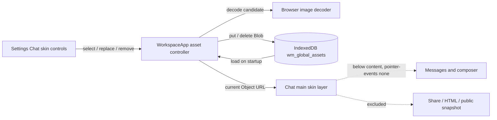

> 由 scope skill 于 2026-08-13 生成
> 状态：已批准 2026-08-14

# 全局聊天背景皮肤

## 目标

为 Workspace 的聊天区域增加一个可选的全局背景皮肤：用户从 Settings 上传图片后，图片在本机持久保存，并以低存在感、不可交互的方式融合在聊天区域左下方。皮肤不改变消息、输入和分享功能的语义，也不要求服务器提供文件上传或同步能力。

## 决策基线

### 需求边界

- 入口位于 `Settings → Chat`，提供上传、替换和移除三个动作。皮肤是全局应用设置，所有项目和对话共用；不提供按项目或按对话配置。
- 图片只保存在当前浏览器/应用实例的本地 IndexedDB 中，保存为图片 Blob；不上传服务器、不保存本地路径、不跨设备同步。刷新或重启同一存储来源后继续生效，清除站点数据或更换设备后不要求保留。
- 接受浏览器能够解码的图片格式，不设置应用层文件大小上限。格式是否支持以浏览器实际解码结果为准，而不是以固定扩展名或 MIME 白名单为准。
- 皮肤只显示在当前聊天区域，不显示在 Settings、Preview、Terminal、登录页或其他工作区表面。它固定在聊天区域左下侧，保持图片原比例并完整显示，按可用区域自动缩放，不裁剪。
- 皮肤使用约 15–20% 的低透明度，并通过底部渐隐与轻微模糊和聊天背景融合。桌面端和移动端都显示；移动端需要响应式缩小，并避开输入框、键盘占位和安全区。
- 皮肤位于消息和输入框的视觉层级下方，`pointer-events` 不拦截任何点击、滚动、拖放、键盘或辅助技术操作。消息文字、代码、菜单和输入内容的可读性优先于皮肤可见度。
- 图片分享、HTML 导出和公共分享均不包含皮肤；分享仍使用现有的内容快照和导出文档，不读取聊天页面的皮肤层。
- 新图片无法被浏览器解码、写入本地存储失败或移除操作失败时，保留当前正在使用的皮肤；如果当前没有皮肤，则继续显示默认背景。Settings 显示可理解的失败提示，用户可以重新尝试。
- 不增加透明度、尺寸、位置或其他皮肤调节项，不新增服务器接口，不修改 Registry protocol version。

### 技术决策

- 二进制皮肤不进入现有 `PersistedGlobalState` 和 `wm_global_kv` JSON 行。新增独立的 IndexedDB 资产 store（`wm_global_assets`），以稳定 key 保存 Blob 及必要的 MIME、文件名和更新时间元数据；数据库版本做一次向后兼容的增量升级，不清理现有设置、聊天缓存或文件缓存。
- `WorkspacePersistenceRepository` / `WorkspaceStore` 为皮肤资产提供独立的异步读取、写入和删除能力。全局偏好状态继续保持 JSON 可克隆，资产 Blob 不参与 `getGlobalState`、全局设置 patch 或现有 JSON 序列化流程。
- 资产写入采用“先验证、后提交”：前端先用浏览器图片解码能力验证新 Blob，持久化成功后才替换当前 Object URL。任何验证或持久化失败都不改变旧资产和当前显示；删除也只有在持久化删除成功后才撤销当前 URL。
- 聊天运行时只保存当前皮肤的 Object URL，并在替换、移除、组件卸载或重新加载资产时释放旧 URL，避免重复选择图片造成资源泄漏。图片加载失败不阻塞 Workspace 其他状态初始化。
- 皮肤层由聊天渲染入口和现有 `.chat-main` 相对定位容器承载，使用独立的非交互层和动态图片样式；消息滚动层、composer、边缘浮层和菜单保留更高的内容层级。移动端沿用已有 composer 位置和键盘/安全区测量结果计算保留空间，桌面端使用聊天区域的保守底部间距。
- 皮肤层不进入 `ChatShareDocument`、Markdown HTML 导出节点或公共分享快照。数据库清理继续通过现有 `deleteDatabase` 清除资产；存储统计包含新增 asset store，JSON 诊断导出仅记录资产元数据，不序列化二进制内容。
- 资产保存失败沿用现有本地存储错误观测机制，同时由 Settings 操作回调提供针对皮肤的就地错误状态；不因保存一个超出配额的皮肤而清空可重建的聊天或文件缓存。

## 设计视图

### 功能设计

Settings 的 Chat 分组增加一个简洁的皮肤控制区。没有皮肤时显示当前无皮肤状态和“选择图片”操作；已有皮肤时显示缩略预览、文件名以及“替换”和“移除”操作。选择图片后，界面先验证浏览器能否解码，再尝试写入本地存储；成功后聊天区域立即显示新皮肤并保留到下次启动。操作进行中控件防止重复提交，失败时保留旧预览和旧背景，并在控制区显示失败原因。

聊天区域将皮肤作为左下角的环境层：完整图片以 `contain` 语义在一个响应式包围盒内呈现，透明度、底部渐隐和轻微模糊控制其存在感。背景层不参与布局，不随消息内容占位，不改变滚动高度；在移动端根据输入框、虚拟键盘和安全区动态收缩可用高度。没有皮肤、正在读取皮肤或读取失败时，聊天继续使用现有背景。

替换、移除和切换项目/对话时，皮肤层保持全局一致。刷新或应用重启后从本地资产恢复；若本地资产读取或解码失败，应用仍正常进入 Workspace，并提示用户重新选择。分享入口的行为和输出内容保持现有语义，皮肤不会出现在任何分享结果中。

### 技术设计

#### 整体方案

设置状态、资产存储和聊天呈现分成三个职责：IndexedDB 资产 store 持有唯一的全局皮肤 Blob；Workspace persistence 负责异步读写和错误收敛；`WorkspaceApp` 负责加载资产、管理 Object URL 生命周期，并把当前 URL 传给聊天主表面；Settings 只负责触发选择/替换/移除和展示操作状态。

`wm_global_assets` 使用单一稳定 key 表示当前皮肤，资产行存放 Blob 和展示所需的轻量元数据。数据库升级只创建缺失的 store；旧客户端已有数据不受影响，旧版本读取不到新资产时仍保持无皮肤默认行为。资产读取采用 best-effort，不让损坏或不可读取的皮肤阻断全局偏好和聊天缓存恢复。

`WorkspaceApp` 在应用启动后读取资产并为 Blob 创建 Object URL；成功解码后将 URL 作为聊天层的动态样式输入。用户选择新文件时先创建候选 URL 并解码，候选通过后写入资产 store；写入成功才切换状态并撤销旧 URL。所有失败路径都保留旧 URL/旧行，并把错误交给 Settings 和既有存储错误提示。卸载、移除和替换完成时释放不再使用的 URL。

聊天层挂在 `.chat-main` 的相对定位上下文中，使用独立的绝对定位节点或等价伪元素承载图片。该层不进入消息虚拟列表和 composer 的布局流，设置比内容更低的 z-index，并禁止指针事件。图片包围盒限制在聊天可视区域的左下侧，桌面端与移动端使用不同的最大尺寸和底部保留空间；移动端使用已有 composer/键盘/安全区测量结果避免覆盖输入区。`prefers-reduced-transparency: reduce` 下关闭模糊并使用更稳定的低对比度融合；`prefers-reduced-motion: reduce` 不引入新的动画。

分享与导出继续从 `ChatShareSnapshot` / `ChatShareDocument` 生成内容，不把当前皮肤 URL 或 Blob 注入快照、导出 HTML 或截图捕获 surface。数据库存储统计读取新增 store 的行数和近似字节数；诊断 JSON 只输出资产 key、文件名、MIME、大小和更新时间等元数据，避免把二进制内容变成不可恢复的 JSON 对象。

#### 关键结构

- 全局皮肤资产：`{k: 'chatSkin', blob: Blob, mimeType: string, name: string, updatedAt: number}`；不存在该行表示无皮肤。
- 运行时皮肤状态：`loading | ready | error` 加当前 Object URL、文件名和就地错误文案；URL 不是持久化数据，所有权归 WorkspaceApp 资产控制器。
- Settings 操作状态：选择中的候选文件、保存/删除进行态和错误文本；候选失败不覆盖已确认的皮肤状态。
- 视觉约束：左下定位、`object-fit: contain`、约 0.17 opacity、底部渐隐、轻微 blur、非交互、内容层级之下，以及移动端 composer/安全区避让。

#### 实现流程

1. 应用启动并完成 Workspace persistence 初始化后，best-effort 读取 `chatSkin` 资产；若存在则创建并验证 Object URL，成功后把它交给聊天主表面。
2. 用户在 Settings 选择文件。控制器不依赖固定扩展名白名单，使用浏览器解码验证候选文件；解码失败时撤销候选 URL、保留旧状态并显示错误。
3. 候选解码成功后写入 `wm_global_assets`。写入完成前聊天仍显示旧皮肤；写入成功后原子切换运行时 URL、撤销旧 URL、更新 Settings 预览和成功状态。
4. 用户移除皮肤时先删除资产行；删除成功后清理运行时 URL并回到默认背景。删除失败时维持旧皮肤并显示错误。
5. 聊天主表面根据当前 URL 渲染不可交互的背景层。布局变化、项目/对话切换、移动键盘和 composer 高度变化时只重新计算视觉层边界，不改变消息和输入布局。
6. 应用卸载或资产被替换时释放当前及候选 Object URL。分享、导出、公共分享和数据库 JSON 导出继续沿用各自现有路径，不读取或嵌入皮肤 Blob。

## 预估改动面

- `app/web/src/workspace/WorkspacePersistence.ts`、`WorkspaceStore.ts`：新增 asset store 的版本升级、Blob 读写/删除、恢复错误处理、清理、存储统计和诊断元数据。
- `app/web/src/app/WorkspaceApp.tsx`、`app/web/src/settings/SettingsRootContent.tsx` 及相关设置/样式：接入全局皮肤状态、文件选择、候选解码、替换/移除操作、错误状态和聊天层渲染。
- `app/web/src/styles/chat.css`、`settings.css` 及必要的基础 token：实现左下融合层、内容层级、响应式尺寸、composer/安全区避让、透明度降级和设置控制区视觉。
- `app/__tests__/`：覆盖 IndexedDB asset 持久化和失败保留、数据库升级/清理/统计、图片解码与 Object URL 生命周期、Settings 操作、响应式聊天层级，以及皮肤不进入分享/导出的回归。
- Wiki 目标：更新 `docs/wiki/frontend-interaction/visual-language.md`，补充全局背景皮肤的层级、融合和可读性约定。

## 验收

- Settings → Chat 无皮肤时可选择图片；选择可被当前浏览器解码的图片后聊天区域立即显示，刷新/重启同一存储来源后仍显示。验证：设置组件测试、持久化测试和手动刷新检查。
- 已有皮肤可替换和移除；替换成功后只显示新图，移除成功后恢复默认背景，所有旧 Object URL 被释放。验证：状态/URL 生命周期测试和手动检查。
- 浏览器能解码的图片格式均可通过，不依赖固定扩展名白名单；应用不拒绝大于某个自定义阈值的文件。验证：不同 MIME/扩展名的候选测试和源码检查无应用大小限制。
- 新图片解码失败、IndexedDB 写入失败或删除失败时，旧皮肤和旧预览保持不变；无旧皮肤时保持默认背景，并显示针对皮肤的错误提示。验证：解码失败、QuotaExceededError、删除失败测试。
- 皮肤为全局配置，在项目和对话之间保持一致；清除数据库后资产不再恢复。验证：项目/会话切换测试和数据库 reset 测试。
- 皮肤位于聊天消息和 composer 下方，左下显示、保持原比例且不裁剪；约 15–20% 透明度、底部渐隐和轻微模糊生效；皮肤层不拦截点击、滚动、拖放或键盘交互。验证：DOM/CSS 断言、可访问性检查和桌面手动检查。
- 桌面与移动端都显示；移动端会随可用空间缩小并避开 composer、虚拟键盘和安全区，不产生额外布局占位或滚动高度。验证：窄屏/宽屏布局测试和移动端手动检查。
- 无皮肤、资产读取失败或浏览器不支持解码时，Workspace、消息、输入、菜单和其他工作区表面仍正常工作。验证：启动失败注入测试及现有 UI 回归测试。
- 图片分享、HTML 导出和公共分享的结果不包含皮肤；数据库 JSON 诊断导出不嵌入 Blob 二进制，只记录资产元数据。验证：分享捕获/导出测试、公共分享快照测试和数据库 dump 测试。
- IndexedDB 升级只新增资产 store，不清除既有全局设置、聊天缓存或文件缓存；不修改 Registry protocol version。验证：升级策略测试、既有 persistence safety 测试和协议版本检查。
- 相关变更通过 `npm test`、`npm run tsc:web` 和 `npm run build:web`；必要的现有聊天/Workspace 测试保持通过。
