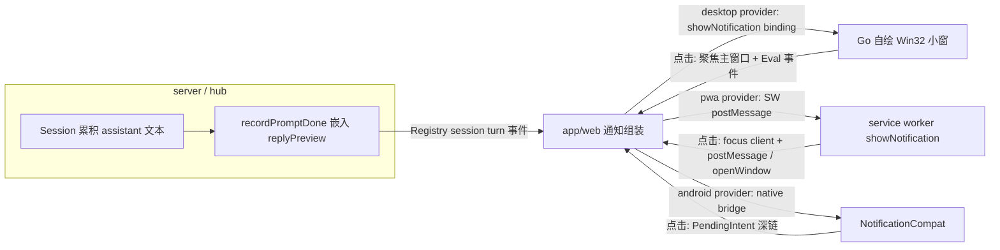

> 由 scope skill 于 2026-08-17 生成
> 状态：已批准 2026-08-17

# 三端 Prompt 完成通知统一重构

## 目标

当前 prompt 完成通知在三端各自为战且均有缺陷：exe 因 WebView2 权限被宿主静默拒绝而完全不弹；PWA 通知图标（SVG）在 Chromium 桌面端静默丢失、点击必然新开重复标签页；APK 状态栏小图标因使用不透明底启动图标而渲染为实心方块；三端通知只堆叠不收敛，内容排版（标题=状态文案）同质化严重。本次重构把通知的内容、弹出形式、点击行为在三端统一为一套 IM 式模型，并修复各端缺陷。

## 决策基线

### 需求边界

- 触发条件保持现状：收到 `prompt_done` 事件，且（页面不可见 或 用户正在查看其他会话）时弹出；同一 turn 只弹一次（现有内存去重保留）。
- 四种结束状态都弹：completed / cancelled / interrupted / failed；视觉归为三类：成功（绿色勾）、失败（红色叉）、停止（灰色方块，cancelled 与 interrupted 共用）。
- 统一内容模型（IM 式）：标题 = 会话标题；正文 = agent 最后一条回复的预览文本；状态差异由图标/颜色承担，不占用标题位。预览为空时正文回落为该状态的短语文案。
- 同会话替换：同一会话最多保留一条通知；该会话有新的完成事件时，替换旧通知内容并重新提醒（重新弹出/响铃）。
- 点击行为三端一致：聚焦应用窗口（exe 为桌面主窗口、PWA 为已有标签页、APK 为 MainActivity）并跳转到通知对应会话。
- 明确不做：Web Push 服务端主动推送不在本次范围；exe 通知不进入 Windows 通知中心（自绘小窗的既定代价）；回复预览可能显示在锁屏/通知中心等系统区域（内容方案 B 的既定代价）。
- 兼容要求：`prompt_done` 新增 `replyPreview` 为增量可选字段，旧版本客户端收到后必须不受影响；不变更协议版本。

### 技术决策

- **预览数据源在 Hub**：`server/internal/hub/client` 的 Session 在 ACP `agent_message_chunk` 更新流过时累积当前 turn 的 assistant 文本；`recordPromptDone` 时把清洗后的预览嵌入 `prompt_done` 的 param（新字段 `replyPreview`）。清洗规则：折叠连续空白为单个空格、去除 markdown 标记、截断到约 160 字符；completed 但无文本（如纯工具调用收尾）时允许为空；failed 时用已有的 error message 兜底。Registry 按现有 turn 内容原样转发，三端经既有同步链路获得，不新增传输通道。
- **exe 走自绘小窗，绕开 WebView2 通知管道**：不修复 go-webview2 的 PermissionRequested bug，改为 Go 宿主创建独立顶层 Win32 小窗（`WS_EX_TOPMOST | WS_EX_TOOLWINDOW | WS_EX_NOACTIVATE`），显示在主窗口所在显示器右下角，数秒自动消失，多条纵向堆叠，同会话重复通知更新已有小窗并重置计时。NOACTIVATE 保证弹出时不抢输入焦点，但点击事件仍可投递。web 与 Go 之间复用现有 desktop bridge：新增 `showNotification` binding 与对应 policy 授权项；点击小窗后 Go 聚焦主窗口（还原最小化 + SetForegroundWindow）并通过 Eval 向页面派发自定义事件完成跳转会话。desktop provider 的权限状态恒为 granted（自绘不需要系统通知授权），exe 上 "Blocked by system permission" 提示随之消失。
- **PWA 修复三点**：通知图标与 badge 从 SVG 换成 PNG（由现有 `app/web/public/icons/icon.svg` 生成的位图资源入仓）；`showNotification` 使用 `tag = <projectId>:<sessionId>` + `renotify: true` 实现同会话替换；`notificationclick` 放弃 `client.url === targetUrl` 全等匹配，改为按 origin 匹配已有窗口客户端——存在则 focus 并 postMessage 触发应用内无刷新跳转，不存在则 `openWindow` 深链 URL。
- **APK 修复两点**：新增透明底单色 `ic_notification` 状态栏小图标（基于现有 logo mark 生成）；通知 ID 从 `hash(project:session:turn)` 改为 `hash(project:session)` 实现同会话原地更新。渠道、深链 PendingIntent、BigTextStyle 保持现状；正文改为预览文本，`setColor` 按状态着色。
- **web provider 体系扩展**：`createNotificationProvider` 选择顺序为 android → desktop → pwa → unsupported；新增 desktop provider 检测 `window.WheelMakerDesktop`（复用既有注入与类型声明模式），`show` 序列化统一 payload 调用 Go binding；点击跳转复用现有 `wmProjectId`/`wmSessionId` 深链消费逻辑（`readPromptCompletionNotificationTarget` 的启动时读取），并新增运行时事件入口（接收 exe Eval 派发或 PWA postMessage 的跳转请求）。

## 设计视图

### 功能设计

通知功能 = 设置开关 + 统一内容模型 + 三端呈现 + 统一点击行为。

设置页 Notifications 开关保持现有入口：打开时调用当前 provider 的 `requestPermission()`；android 走系统运行时权限，pwa 走浏览器授权，desktop 恒 granted 直接可用。权限被永久拒绝（android/pwa 的 denied）时保留现有 "Blocked by system permission" 提示；exe 上不再出现该提示。

通知呈现的统一模型：

- 标题：会话标题（空标题沿用现有 sessionId 兜底）。
- 正文：回复预览；预览为空时回落状态短语（如 "Prompt cancelled"）。
- 状态视觉：成功绿、失败红、停止灰。PWA 以正文符号前缀表达（✓ / ✗ / ■），APK 以 `setColor` 染色，exe 自绘色点。

同会话替换在各端的可观察行为一致：用户未点击旧通知时，同会话新通知不增加通知数量，而是更新内容并再次提醒。

点击后的可观察行为一致：应用成为前台焦点，且界面切换到通知对应的项目+会话。PWA 已有标签页时不新开页面；无已有标签页时打开深链 URL 完成同样的落点。

失败与边界行为：

- `replyPreview` 缺失（旧 Hub、纯工具 turn）：正文回落状态短语，通知正常弹出。
- exe 点击小窗时主窗口已最小化：还原并聚焦后再派发跳转事件。
- PWA 点击时浏览器无任何已开窗口：`openWindow` 深链 URL，启动时现有深链消费逻辑完成跳转。
- provider 不可用（unsupported）：开关无法打开，行为同现状。

### 技术设计

#### 整体方案

职责划分：Hub 唯一负责预览文本的生产与清洗（所有客户端共享同一份）；app/web 唯一负责触发判定、内容组装与跳转落点（三端共用）；各端 provider 只负责呈现与点击回传。状态与数据所有权不新增存储：通知不产生持久状态，替换语义由各端通知系统的 tag/ID 机制承担。

#### 关键结构

统一 payload（`WheelMakerNotificationPayload` 扩展）：

- 保留：type、projectId、sessionId、turnIndex、status、url（深链）
- 语义调整：title 恒为会话标题；新增 `preview` 字段承载回复预览；`body` 字段由组装层按统一规则生成（预览或回落短语，含 PWA 用的状态符号前缀），各端 provider 不再各自拼装文案
- sessionId 级别的替换键：`projectId:sessionId`（PWA tag、Android 通知 ID、exe 小窗归并键共用此规则）

exe 自绘小窗：

- 进程内独立 HWND，归 Go 宿主所有；生命周期 = 自动消失计时（基准 5 秒）或用户点击
- 多条通知按会话键归并；不同会话的小窗纵向堆叠，超出屏幕高度时最旧让位
- 渲染内容：状态色点 + 会话标题 + 预览文本（截断）；字体/DPI 遵循系统主显示器设置

web 跳转入口（三端归一）：把"跳转到指定 projectId+sessionId"抽为单一运行时入口，供 exe Eval 事件、PWA postMessage、启动时 URL 参数三条路径复用。

#### 实现流程

1. Hub：prompt 结束时，`recordPromptDone` 把当前 turn 累积的 assistant 文本清洗为 `replyPreview` 嵌入 param（失败场景用 error message）；SessionRecorder 落盘并上报 Registry。
2. Web：`prompt_done` 事件到达 → 现有触发判定（不可见/非当前会话/去重）→ 组装统一 payload（标题=会话标题、preview、body 按规则生成）→ 当前 provider 的 `show(payload)`。
3. PWA：SW 收到 `WM_PWA_NOTIFY` → `showNotification(tag=会话键, renotify=true, icon/badge=PNG)`；`notificationclick` → 按 origin 匹配窗口客户端 → 有则 focus + postMessage 跳转，无则 openWindow(深链)。
4. APK：native bridge `showNotification` → 渠道内 `notify(hash(会话键))` 原地更新 → 点击 PendingIntent 回 MainActivity 深链（现状链路）。
5. exe：Go binding 收到 payload → 自绘小窗按会话键归并弹出/更新 → 点击 → 还原并聚焦主窗口 → Eval 派发跳转事件 → web 运行时入口切换会话。
6. 权限路径：desktop provider 恒 granted；pwa/android 权限拒绝时维持现有提示与开关回退。

### 预估改动面

- `server/internal/hub/client`：Session 累积 assistant 文本、`recordPromptDone` 嵌入 `replyPreview`；测试并入现有 `client_test.go` / `session_*_test.go`
- `server/cmd/wheelmaker-desktop`：新增自绘通知小窗（Win32）、`showNotification` binding 注册与 policy 授权项、点击聚焦与 Eval 回传；测试并入现有 `*_test.go`
- `app/web`：notifications 模块（payload 扩展、组装规则、desktop provider、provider 选择顺序）、service-worker.js（PNG 图标、tag 替换、click 聚焦跳转）、WorkspaceApp 跳转运行时入口、`public/icons` 新增 PNG 资源（由 SVG 生成的产物入仓）
- `mobile/android`：`AndroidNotificationRuntime.kt`（单色小图标、通知 ID 收敛、预览正文、setColor）、新增 `ic_notification` 资源
- wiki：新建 `docs/wiki/features/prompt-completion-notifications.md`

## 验收

- exe 主窗口最大化/还原/最小化/被遮挡时，prompt 完成 → 屏幕右下角弹出自绘小窗，标题为会话标题、正文为回复预览、带状态色点；验证：四状态下实机观察
- exe 点击小窗 → 主窗口还原聚焦且页面切换到对应会话；验证：实机点击观察落点
- exe 同一会话连续完成两个 turn（中间不点通知）→ 始终只有一条小窗，内容为最新；验证：实机观察
- PWA（Chrome/Edge 桌面）通知 → 图标正常显示（非空白）；同会话第二条通知替换第一条；点击已开标签页时聚焦该页并无刷新跳转到会话，不新开标签页；验证：devtools Application 面板 + 实机观察
- APK 通知 → 状态栏小图标为单色剪影（非实心方块）；同会话新通知原地更新；正文显示回复预览；点击跳转对应会话（保持现状）；验证：实机/模拟器观察
- `prompt_done` turn 的 param 包含清洗后的 `replyPreview`（completed 有文本时非空、failed 时为 error message）；验证：server 单测断言
- 旧客户端收到含 `replyPreview` 的 `prompt_done` → 无解析错误、通知行为不变；验证：字段为可选增量的类型断言与既有单测不回归
- cancelled / interrupted / failed 完成事件同样弹通知，视觉为停止/失败样式；验证：web 单测覆盖组装规则 + 实机抽查
- 预览缺失时正文回落状态短语，通知仍弹出；验证：web 单测
- web 端 provider 选择：android bridge 存在选 android、`WheelMakerDesktop` 存在选 desktop、secure context 选 pwa、否则 unsupported；验证：web 单测
