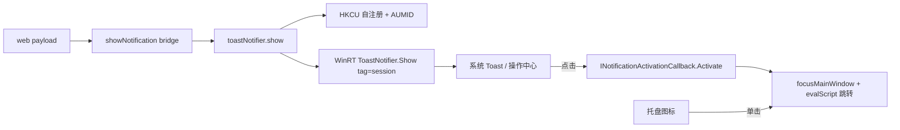

> 由 scope skill 于 2026-08-18 生成
> 状态：已批准 2026-08-18

# Desktop WinRT Toast 通知

## 目标

exe 端 prompt 完成通知从托盘气球换成真正的 WinRT 系统 Toast。当前气球方案经实测存在硬天花板：Toast 顶部应用名固定显示为 `Microsoft.Explorer.Notification.{...}`、无法展示应用图标、无法按会话去重。目标形态：Toast header 显示 WheelMaker 图标与应用名，第一行 session title，第二行回复内容，同会话去重，点击定位会话。

## 决策基线

### 需求边界

- Toast 样式：系统推荐样式（ToastGeneric），不使用 appLogoOverride 大头像；header 的图标与应用名 "WheelMaker" 来自 AUMID 注册信息。
- 内容模型与 APK 一致：第一行 = session title（空标题回落 sessionId，沿用现有 `resolveChatSessionTitle` 语义），第二行 = 回复预览（为空时回落状态短语，沿用现有 `promptCompletionStatusPhrase` 语义）。
- 状态视觉差异：第二行正文加符号前缀（completed → ✓、failed → ✗、cancelled/interrupted → ■），与 PWA 约定一致；气球时代的 NIIF 图标映射废弃。
- 同一会话新通知替换旧通知并重新提醒：WinRT `Tag = projectId:sessionId`；正文无需 Go 侧截断（hub 的 `replyPreview` 已限长约 160 字符，Toast 文本自动换行与截尾）。
- 点击 Toast（横幅或操作中心历史条目）→ 聚焦主窗口并跳转到对应会话；应用未运行时点击历史条目 → Windows 拉起应用后经同一点击回调完成跳转。
- 托盘图标保留：单击聚焦/还原主窗口，作为常驻入口供后续扩展；气球发送代码删除，托盘不再是通知通道。
- 失败行为：Toast 管道任一环节失败（注册、XML 装载、COM 调用）→ 该条通知丢弃，`show` 返回 `{"ok":false,...}`，web 端无用户可见异常；无降级通道。
- web 端零改动：桥接口、JSON payload、通知设置开关不变；PWA / APK 通知路径不受影响。
- 注册表写入全部在 HKCU（无需管理员权限），应用启动时自注册，不依赖安装脚本；不修改协议版本。
- 仅影响 Windows 桌面端（`cmd/wheelmaker-desktop`，`_windows` 构建标签）。

### 技术决策

- AUMID 固定为 `WheelMaker.Desktop`，启动时调用 `SetCurrentProcessExplicitAppUserModelID`。
- 启动自注册（幂等覆盖写，跟随当前 exe 路径）：
  - `HKCU\Software\Classes\AppUserModelId\WheelMaker.Desktop`：`DisplayName="WheelMaker"`、`IconUri=<释放到磁盘的图标 PNG 路径>`、`CustomActivator={固定 CLSID}`。
  - `HKCU\Software\Classes\CLSID\{固定 CLSID}\LocalServer32` = 当前 exe 路径。
  - 图标来源：`go:embed` 内嵌 `winres/icon.png`，释放到 `~/.wheelmaker/desktop/` 下的稳定路径供 IconUri 引用。
- 点击回调：进程内 COM local server——`CoRegisterClassObject`（`REGCLS_MULTIPLEUSE`）注册 `INotificationActivationCallback` 的实现（手写 COM vtable，代码库已有 `webview_profile_windows.go` 手写 vtable 先例）；`Activate(app, args, data, count)` 解析 args 中的 projectId/sessionId → `focusMainWindow()` + `evalScript` 派发现有 `wheelmaker:desktop-notification-click` 事件。`Activate` 运行在 RPC 线程，`focus`/`eval` 必须切回 UI 线程执行（如 `PostMessage` 到托盘隐藏窗口中转）。应用未运行场景由 Windows 经 LocalServer32 拉起进程后走同一 `Activate`，因此应用启动时需尽早完成 class object 注册。
- Toast 发送：手写 WinRT 互操作（`combase!RoGetActivationFactory`、winrt string DLL 的 HSTRING 辅助、`Windows.Data.Xml.Dom.XmlDocument.LoadXml`、`IToastNotification::put_Tag`、`IToastNotificationManagerStatics::CreateToastNotifierWithId(AUMID)`、`IToastNotifier::Show`），不引入第三方依赖；标题/正文做 XML 转义；XML 根节点含 `launch="projectId=...&sessionId=..."` 与 `activationType="foreground"`。
- `desktopNotificationSink` 接口（`show(raw string) string` / `close()`）保持不变，`webview_windows.go` 装配处仅替换构造器；托盘图标（`Shell_NotifyIcon` NIM_ADD + 单击聚焦 + NIM_DELETE）与气球解耦后保留。
- COM/WinRT 边界全部收敛在注入的 ops 接口之后，单测不触碰真实 COM。
- 已知代价：dev 构建与正式构建共用同一 AUMID/CLSID，注册表指向最后运行的 exe 路径（last-run-wins）。

## 设计视图

### 功能设计

入口不变：agent prompt 完成 → web 组包 → `WheelMakerDesktop.showNotification` 桥 → Go `sink.show()`。通知以系统 Toast 呈现：header 为 WheelMaker 图标与名称，第一行 session title，第二行为带状态符号前缀的回复预览。同一会话的重复完成事件替换该会话已有 Toast 并重新弹出。用户点击 Toast（横幅或操作中心历史条目）后应用聚焦并打开对应会话；应用未运行时系统拉起应用并完成同样跳转。托盘图标常驻，单击聚焦主窗口。Toast 管道失败时该条通知静默丢弃，bridge 返回 `ok:false`。

### 技术设计

#### 整体方案

`desktop_notification_windows.go` 重组为两个职责：托盘图标（保留 NIM_ADD / 单击聚焦 / NIM_DELETE，删除气球发送）与 WinRT Toast 通知器（实现 `desktopNotificationSink`）。COM/WinRT 互操作收敛到独立新文件（HSTRING 辅助、`RoGetActivationFactory` 封装、`INotificationActivationCallback` vtable、注册表自注册）。通知器通过注入的 ops 接口调用全部 COM 能力，单测用 fake ops 覆盖。

#### 关键结构

- Toast XML：`<toast launch="projectId=<pid>&sessionId=<sid>" activationType="foreground"><visual><binding template="ToastGeneric"><text>{title}</text><text>{符号前缀 + body}</text></binding></visual></toast>`，所有文本节点 XML 转义。
- `Tag = projectId:sessionId`（去重键，与现有 `promptCompletionSessionKey` 同语义）。
- AUMID、CLSID、注册键路径、图标释放路径均为固定常量；自注册在通知器构造时幂等执行。

#### 实现流程

1. 装配（`webview_windows.go`）：构造通知器 + 托盘图标；通知器构造时完成 HKCU 自注册、`SetCurrentProcessExplicitAppUserModelID`、`CoRegisterClassObject`。
2. `show(raw)`：`parseDesktopNotification` 解析（保留）→ 组装标题/正文（符号前缀）→ XML 转义 → ops.showToast（LoadXml → CreateToastNotification → put_Tag → Show）→ 任一失败返回 `ok:false`。
3. 点击：`Activate` 回调解析 args → `focusMainWindow()` → `evalScript` 派发 `wheelmaker:desktop-notification-click`（detail 带 projectId/sessionId），web 侧现有入口完成跳转。
4. `close()`：`CoRevokeClassObject`、托盘 `NIM_DELETE`、销毁隐藏窗口；注册表项保留（下次启动覆盖写）。

### 预估改动面

- `server/cmd/wheelmaker-desktop/desktop_notification_windows.go`：删除气球发送，托盘图标保留，sink 换成 WinRT toast 通知器。
- `server/cmd/wheelmaker-desktop/` 新文件：WinRT/COM 互操作与注册表自注册。
- `server/cmd/wheelmaker-desktop/desktop_notification_windows_test.go`：重写；新互操作逻辑的单测随实现文件就近放置（沿用现有测试文件优先）。
- `server/cmd/wheelmaker-desktop/webview_windows.go`：装配处至多一行替换。
- wiki：更新 `docs/wiki/features/prompt-completion-notifications.md`。
- 测试范围：`go test ./cmd/wheelmaker-desktop`（Windows，server 目录）。

## 验收

- `go build ./cmd/wheelmaker-desktop` 与 `go test ./cmd/wheelmaker-desktop` 通过；验证证据：命令输出。
- 单测覆盖：payload 解析、状态符号前缀映射、XML 转义（含特殊字符的 title/body）、Tag 去重键、Toast 失败时 `show` 返回 `ok:false`、Activate 回调解析 args 并派发定位事件、托盘单击聚焦、close 清理；验证证据：`go test -v` 输出。
- 手测：prompt 完成 → Toast header 显示 WheelMaker 图标与名称，第一行 session title，第二行带状态符号的回复预览；验证证据：用户观察。
- 手测：同一会话连续完成 → 该会话在操作中心只保留最新一条且重新弹出；验证证据：用户观察。
- 手测：点击横幅与操作中心历史条目 → 聚焦主窗口并跳转对应会话；验证证据：用户观察。
- 手测：托盘图标存在，单击聚焦主窗口；退出应用托盘图标消失；验证证据：用户观察。
- 兼容：PWA / APK 通知路径不受影响；验证证据：web 端零改动 diff + `go test ./...`（server）通过。
