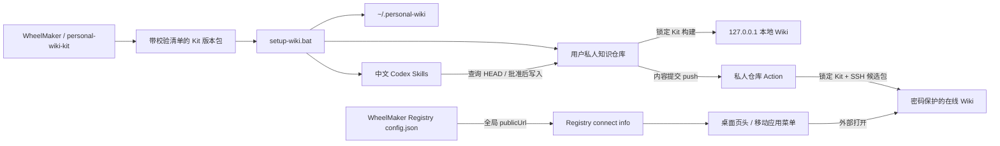

> 由 scope skill 于 2026-08-18 生成
> 状态：已批准 2026-08-18

# Personal Wiki Kit 与 WheelMaker 入口

## 目标

把现有个人 Wiki 从“程序、Skill、部署代码和私人知识混在同一个私有仓库”重构为可公开复用的 Personal Wiki Kit 与每位用户独立的私人知识仓库。Kit 在 WheelMaker 仓库内独立开发、版本化和发布；普通 Windows 用户无需 Node 或 Go 即可初始化、查询、打开和一键发布自己的 Wiki。WheelMaker 只增加一个由 Registry 全局配置控制的网站入口，不读取知识、工程路由、密码或部署状态。

## 决策基线

### 需求边界

- 公共 Kit 源码位于 WheelMaker 顶层 `personal-wiki-kit/`，使用独立版本号、校验清单和发布包；用户可以只下载 Kit 发布包，无需克隆整个 WheelMaker。
- 公共 Kit 包含 Wiki 阅读界面、内容契约与校验器、查询/构建/发布工具、本地只读服务、两个全中文 Codex Skill、Windows BAT 入口、空白模板、虚构示例和参数化的 Linux 自建部署方案。
- 公共 Kit 及其 Git 历史不得包含任何真实私人文章、附件、本机路径、域名、IP、账号、密码、令牌、SSH 材料或其他用户基础设施信息。现有私人仓库只能按明确白名单导出可复用文件，不能复制其 `.git` 历史。
- 每位用户的私人仓库只保存知识数据与薄集成文件：`content/articles/*.md`、`content/registry/{taxonomy,projects,articles}.yaml`、受支持的 `attachments/`、站点显示配置、Kit 版本锁、BAT 启动器以及可选的 GitHub Actions；不保存 Kit 的网页、服务器、Skill 或构建器源码。
- 私人仓库中的 Kit 锁文件是目标 Kit 版本与发布包校验值的唯一事实来源。打开、查询和发布都使用该锁定版本；发现新版只提示，只有显式执行 `update-wiki-kit.bat` 才升级并运行兼容检查或迁移。
- 第一版完整支持 Windows 客户端和 Linux 自建服务器。Windows Kit 发布包自带执行所需的运行时、预构建网页资源和本地服务器；用户只必须安装 Git，GitHub CLI 是可选增强，不要求安装 Node、Go 或 npm 依赖。
- `setup-wiki.bat` 默认创建可离线使用的本地私人 Git 仓库。检测到已登录的 GitHub CLI 后，只有用户明确选择才创建私人远端；未安装或未选择时不执行任何 GitHub 写操作。
- 本机唯一配置目录为 `~/.personal-wiki/`：`config.json` 保存 schema、私人仓库位置和可选网站地址，`project-routing.json` 保存本机来源路径到 Wiki 项目 ID 的映射。真实绝对路径不进入公共 Kit 或私人知识仓库。
- 初始化器检测旧的 `~/.codex/personal-wiki.json` 和已安装 `publish-knowledge` Skill 内的旧工程路由，展示迁移预览并在用户确认后写入新目录；迁移前保存可恢复备份，验证成功后新 Skill 只读取新位置，禁止永久双读造成来源冲突。
- 第一版正式支持 Codex Skill：自动安装全中文 `lookup-knowledge` 与 `publish-knowledge` 到用户级 Codex Skill 目录；Skill 程序可升级，本机配置与工程映射不得因 Skill 或 Kit 更新被覆盖。配置格式保持 Agent 无关，以便后续增加其他 Agent 适配器。
- 工程路由继续支持最长包含根路径、多个来源合并去重、多个本机工程映射到同一个 Wiki 项目，以及未匹配来源进入“未指定项目”；业务工程和 WheelMaker 工程配置均不保存映射。
- `lookup-knowledge` 默认只查询私人仓库 Git `HEAD`；`publish-knowledge` 必须先在当前对话提出准确候选，只有用户逐项明确批准后才能写入私人仓库。原始对话、草稿、临时发现和凭据不得进入 Wiki。
- `open-wiki.bat` 使用锁定 Kit 在本机构建并启动只监听 `127.0.0.1` 的只读服务，自动选择可用端口并打开浏览器；不得监听局域网地址。在线服务器不是本地使用的前置条件。
- `publish-wiki.bat` 沿用知识数据白名单：校验、构建并测试后只暂存允许的知识路径，从私人仓库解析远端与默认分支，提交当前批准的知识变更；有远端时拉取变基后普通推送，无远端时保留本地提交并明确报告未部署。存在 Kit 源码、未知文件或其他非知识改动时停止，不使用 `git add -A`。
- 可选在线模式把现有密码保护、GitHub Actions、SSH 固定主机身份、候选包校验、原子激活、健康检查和回滚能力参数化。用户提供自己的域名、服务器和 GitHub Secrets；仓库不保存明文密码或部署私钥。
- 在线 Wiki 第一版采用“每个 Wiki 一个访问密码”：初始化器只生成适合服务器保存的密码哈希，服务签发安全 Session Cookie；不实现多用户账号、权限管理或密码找回系统，也不允许用秘密 URL 代替认证。
- 现有私人 Wiki 原地迁移到纯知识数据结构，保留其私有 Git 历史、稳定文章 ID/URL、现有域名和在线服务。迁移后的发布工作流必须与新用户共用同一 Kit，不长期维护旧版私有程序仓库模式。
- WheelMaker Registry 所在安装的 `config.json` 可选配置全局 `knowledgeRegistry.publicUrl`。该值只允许由 scheme、host 和可选端口组成的规范 origin，不允许 userinfo、query 或 fragment；公网使用 HTTPS，loopback 本地模式允许 HTTP。该配置不得接受密码、令牌或其他凭据字段。
- WheelMaker Web 从 Registry 获取这一个全局地址，远程 Hub 不能上报或覆盖。已配置时，桌面 Chat 页头在 Terminal 与 Files 动作附近显示 Personal Wiki 图标按钮，移动端应用菜单显示“Personal Wiki”；未配置时两个入口均不渲染。
- 点击 WheelMaker Wiki 入口在普通浏览器中打开新标签页，在 Desktop 中交给外部浏览器；不替换当前 WheelMaker 页面，不在 Preview/iframe 中嵌入 Wiki，不读取或转发 Wiki 登录状态。
- Registry URL 的投影使用向后兼容的可选连接信息，不修改 Registry protocol version；旧客户端忽略该字段，未配置或旧服务端下维持当前 UI。

### 技术决策

- `personal-wiki-kit/` 是公共程序唯一源码，内部按 CLI/内容核心、预构建 Reader、本地及在线 Server、Skills、模板、部署资产和测试分层。WheelMaker 根发布编排为 Kit 生成独立版本化产物，不把私人仓库纳入 WheelMaker 构建。
- Windows Kit 包内置私有 runtime 与已锁定依赖，BAT 只定位 Kit 缓存并调用其 CLI；每次运行先验证 release manifest 和文件哈希。Reader 的 JS/CSS 在 Kit 发布时构建，私人仓库构建只校验 Markdown/YAML、生成目录/搜索/文章数据并复制锁定 Reader，不运行 webpack 或 `npm install`。
- Kit 至少发布 Windows 客户端包和供 GitHub Actions/Linux 部署使用的 Linux 构建/服务器资产。私人仓库工作流按锁文件下载精确版本并校验摘要，禁止使用浮动 `latest` 参与正式发布。
- 用户级 `~/.personal-wiki/config.json` 不重复保存目标 Kit 版本；版本权威来自私人仓库锁文件。Kit 下载后按版本和平台缓存，更新命令以候选缓存完成兼容检查后再原子改写锁文件，失败保持旧版本可用。
- 私人仓库中的 BAT、工作流和配置是薄适配层，只调用锁定 Kit 的稳定命令契约。至少提供 `setup`、`open`、`check`、`query`、`publish`、`update`、`deploy provision` 与 `deploy verify` 能力；具体内部任务拆分由实施计划决定。
- 新建私人仓库使用 Kit 模板直接生成；迁移现有仓库使用同一 schema 的幂等迁移器。迁移器先 dry-run、建立配置备份和 Git 可恢复点，再删除最新树中的私有程序副本并生成薄适配层；任何校验失败不得提交或切换在线发布工作流。
- Skill 从 `~/.personal-wiki/config.json` 定位私人仓库，从 `~/.personal-wiki/project-routing.json` 解析来源项目。Skill 自身只包含规则、脚本和示例，不包含用户路径；安装与更新采用临时候选目录校验后替换，保留用户配置。
- Registry 服务配置增加只读的 `KnowledgeRegistryPublicURL` 输入，并在 `connect.init` 的 `serverInfo` 中投影可选的规范化地址。该字段属于 Registry 实例，而不是 Hub descriptor；Go 和 TypeScript 协议结构均使用 `omitempty`/可选字段，不提升协议版本。
- Web Registry Client 保留 `connect.init` 响应中的全局地址并交给 Workspace shell。桌面页头和移动端应用菜单消费同一状态与同一安全打开函数；URL 缺失或校验失败时没有入口，也不得用编译期默认值或个人域名回退。
- 在线部署继续以内容提交为触发源：Action 下载锁定 Kit、校验内容与服务、生成带 manifest 的候选包，通过严格 host key 的 SSH 上传，服务器验证完整性后原子切换并健康检查；激活失败恢复旧 release。凭据只存在于 GitHub Secrets、服务器受限配置或用户交互输入。

## 设计视图

### 功能设计

新用户下载 WheelMaker 发布页中的 Personal Wiki Kit Windows 包并运行 `setup-wiki.bat`。初始化器引导选择本地目录、站点名称和可选网站地址，创建空白私人 Git 仓库、三份注册表、示例/空白内容、版本锁和 BAT；随后安装两个中文 Codex Skill，并写入独立用户配置。GitHub CLI 可用时提供“创建私人远端”选择，但默认本地完成，不要求服务器。

日常使用时，`open-wiki.bat` 在 loopback 启动只读 Wiki；AI 在实质任务开始通过 `lookup-knowledge` 查询已提交快照，结束时由 `publish-knowledge` 提议可靠知识，获得明确批准后更新私人仓库。用户双击 `publish-wiki.bat` 完成内容白名单检查、构建、测试、提交和可选推送；配置了在线部署的仓库在 push 后由 Action 完成受保护发布。Kit 有新版时只提示，用户显式运行更新入口后才升级。

WheelMaker 与该流程只有网站入口联动。Registry 管理员在本机 `config.json` 配置一个全局 Personal Wiki URL，所有连接该 Registry 的 Web 客户端获得同一非秘密地址。桌面用户从 Chat 页头直接打开，移动用户从应用菜单打开；没有配置的 WheelMaker 与当前行为完全一致。

### 技术设计

#### 整体方案



公共 Kit、私人知识和 WheelMaker 入口形成三条单向边界：Kit 提供程序但不读取私人基础设施；Skill/CLI 经用户级定位读取私人仓库；WheelMaker 只接收 Registry 配置中的公开网站地址。任何一条链路都不要求 WheelMaker 读取 `~/.personal-wiki`，也不允许私人仓库反向进入 WheelMaker 发布产物。

#### 关键结构

用户级配置：

```json
{
  "schema": 1,
  "repositoryPath": "D:/path/to/private-wiki",
  "publicUrl": "https://wiki.example.com"
}
```

工程路由：

```json
{
  "schema": 1,
  "routes": [
    {
      "projectId": "shared-engine-projects",
      "roots": ["C:/example/ProjectA", "C:/example/ProjectB"]
    }
  ]
}
```

私人仓库锁文件至少记录 schema、Kit 版本、目标发布来源和平台包摘要；正式命令只接受摘要匹配的版本。站点显示配置只包含标题、语言等非秘密展示项。GitHub 仓库、默认分支和远端名称继续由私人 Git 仓库解析，不写入 Personal Wiki 配置。

WheelMaker 配置：

```json
{
  "knowledgeRegistry": {
    "publicUrl": "https://wiki.example.com"
  }
}
```

`knowledgeRegistry` 只允许 `publicUrl`；严格配置解析必须拒绝 `password`、`token`、`repositoryPath` 等未知或秘密字段。

#### 实现流程

1. Kit 发布：WheelMaker CI 对 `personal-wiki-kit/` 执行单元/集成测试，构建 Reader、Windows 包与 Linux 资产，生成 manifest/摘要并以独立 Kit 版本发布；发布前运行秘密、真实路径和非示例内容扫描。
2. 初始化：验证 Kit 自身 → 收集最少输入 → 生成私人仓库与锁文件 → 可选创建 GitHub 私有远端 → 原子安装 Skill → 写入用户配置；任一步失败时删除未完成候选或恢复备份，不覆盖已有仓库。
3. 旧配置迁移：读取旧位置并展示差异 → 用户确认 → 备份 → 写新配置 → 用新 Skill 分别解析仓库与代表性工程 → 成功后停止旧位置读取；失败恢复新配置前状态。
4. 本地打开：读取用户配置与仓库锁 → 验证/获取锁定 Kit → 校验并构建数据 → 在 loopback 可用端口启动只读服务 → 打开浏览器；进程退出时释放端口与临时产物。
5. 知识查询/落库：Skill 根据当前工作区解析项目 ID，查询默认只读 `HEAD`；发布 Skill 在批准后修改文章和注册表、运行 Kit 校验，并把提交/推送交给一键发布入口或明确授权的 Git 工作流。
6. 一键发布：分类工作树改动 → 非知识改动立即停止 → 校验/测试/构建 → 只暂存允许路径 → 提交 → 有远端时 fetch/rebase/复验/push → 可观测时等待 Action；任何失败保留可诊断状态且不声称在线发布成功。
7. 显式升级：下载候选 Kit 并校验 manifest → 对私人仓库运行兼容检查/迁移 dry-run → 备份旧锁和配置 → 迁移并完整验证 → 原子更新锁；失败继续使用原锁与缓存。
8. 在线部署：Action 读取锁定版本 → 构建候选站点 → SSH 上传 → 服务器校验 manifest 和文件白名单 → 原子切换 → 健康检查；失败不改变或恢复当前 release。
9. WheelMaker 入口：Registry 启动时规范化全局 URL → `connect.init` 返回可选字段 → Web 保存连接级配置 → 桌面页头与移动菜单按存在性渲染 → 统一外部打开函数打开 URL。
10. 现有私人 Wiki 迁移：先用新 Kit 对当前知识生成等价站点并比较文章 ID、目录和搜索数据，再切换私人仓库工作流；完成一次真实候选发布和受保护网址验证后，才删除最新树中的旧程序副本。

### 预估改动面

- `personal-wiki-kit/`：新增公共 Kit 源码、内容核心、Reader、本地/在线 Server、中文 Skills、模板、Windows 启动器、部署资产、迁移器、发布打包和测试。
- WheelMaker 根构建/发布脚本与工作流：增加独立 Kit 版本、平台包、manifest、摘要、发布资产和敏感信息扫描，不改变普通 WheelMaker 发布语义。
- `server/internal/shared`、`server/internal/registry`、`server/cmd/wheelmaker` 与协议类型：增加并验证 Registry 全局 Wiki URL，投影可选连接信息；不修改 Registry protocol version。
- `app/web/src/registry`、`app/web/src/app/WorkspaceApp.tsx`、`app/web/src/shell/WheelMakerAppMenu.tsx`、图标/样式及现有相关测试：保存全局 URL，增加桌面和移动入口，统一外部打开行为。
- 现有私人 Personal Wiki 仓库：迁移为数据仓库，生成 Kit 锁、薄 BAT 和可选 Action；保留内容与私有历史，替换构建/Skill/部署程序所有权。
- 用户级安装：把旧 Codex 定位配置和工程路由一次性迁移到 `~/.personal-wiki/`，安装新版 Skill；不得把这些机器级文件提交到 WheelMaker 或私人仓库。
- Wiki：更新 `docs/wiki/features/knowledge-registry.md`、`docs/wiki/architecture/server-runtime.md`、`docs/wiki/frontend-interaction/pc-chat-sidebar-modes.md` 和 `docs/wiki/frontend-interaction/app-menu.md`。
- 测试范围：Kit 的 Node/Go/打包/迁移集成测试，WheelMaker Go Registry/config 测试，Web Registry/UI 测试，Windows 无宿主 Node 的端到端 smoke，Linux 部署候选/回滚 smoke，以及现有 WheelMaker 回归测试。

## 验收

- 公共边界：从 WheelMaker 的干净公开历史构建 Kit，扫描结果不包含现有私人 Wiki 的文章、附件、真实路径、域名、IP 或凭据；验证证据：白名单导出测试、秘密/路径扫描和人工文件清单审阅。
- 独立安装：一台仅安装 Git、没有 Node/Go/npm 的 Windows 测试环境可从 Kit 发布包运行 `setup-wiki.bat`，创建私人仓库、锁文件、用户配置、两个中文 Skill，以及仓库内的 `open-wiki.bat`、`publish-wiki.bat`、`update-wiki-kit.bat`；验证证据：Windows smoke 日志与生成目录断言。
- GitHub 可选性：没有 GitHub CLI 或用户拒绝时初始化完整成功且不产生网络写入；用户明确同意且 CLI 已登录时只创建 private repository 并正确添加远端；验证证据：mock 集成测试及远端可见性检查。
- 配置迁移：旧定位文件与多工程同项目路由可迁移到 `~/.personal-wiki/`，迁移前有预览和备份，新 Skill 验证成功后不再读取旧配置；注入失败时恢复旧状态；验证证据：迁移 fixtures 与回滚测试。
- 路由与查询：多个工程根映射同一项目、最长根覆盖、多个来源合并、未匹配来源和默认仅查询 Git `HEAD` 均保持现有语义；验证证据：路由/查询单测及代表性工作区 smoke。
- 本地使用：`open-wiki.bat` 使用锁定 Kit 在 `127.0.0.1` 可用端口打开完整目录、搜索、文章和附件，局域网地址无法连接；验证证据：端口绑定断言、HTTP smoke 和浏览器手测。
- 发布安全：`publish-wiki.bat` 对允许的文章、注册表和附件完成校验、构建、提交与可选推送；非知识改动、摘要不匹配、脏默认分支、rebase 冲突或测试失败均停止且不误暂存；验证证据：Git fixture 集成测试。
- 版本可复现：同一私人仓库锁定版本在 Windows 本地与 Linux Action 生成等价内容 manifest；发布不会自动升级，显式更新成功才原子改锁，失败继续使用旧 Kit；验证证据：跨平台 manifest 测试和更新回滚测试。
- 在线安全：参数化 provision 不含个人默认值，密码明文不进入仓库或 Action，未认证请求无法读取页面、文章数据和附件；候选损坏或健康检查失败不替换当前 release；验证证据：Go 安全测试、部署 smoke 和回滚测试。
- WheelMaker 配置：合法 HTTPS 与 loopback HTTP URL 被规范化，未知凭据字段和危险 URL 被拒绝；远程 Hub 不能覆盖 Registry 全局值；验证证据：shared config、Registry connect 和兼容性测试。
- WheelMaker UI：配置 URL 时桌面页头在 Terminal/Files 附近出现可访问的 Personal Wiki 按钮，移动应用菜单出现对应行，二者打开同一外部地址；未配置和旧服务端时入口不存在且当前 UI 不变；验证证据：React/静态契约测试与 Browser/Desktop/移动手测。
- 协议兼容：Registry protocol version 不变，带可选 URL 的新服务端可被旧客户端连接，新客户端连接旧服务端时正常工作；验证证据：Go/TypeScript 连接 fixtures 与协议版本 diff 审核。
- 现有 Wiki 迁移：迁移前后文章稳定 ID、URL、分类/项目双视图、搜索结果和附件可用性一致；完成一次真实知识提交、Action 发布、登录访问与原子 release 检查后才移除旧程序副本；验证证据：迁移对比报告和受保护站点 smoke。
- 回归：WheelMaker 相关 Go/Web 测试、Kit 全套测试及构建通过，且变更不引入协议版本升级或私人仓库内容；验证证据：CI 与本地验证命令输出。
