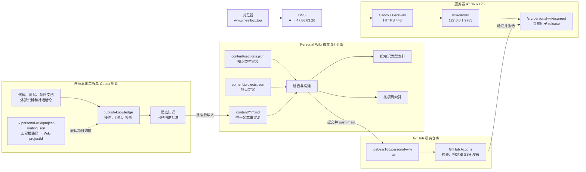

> 摘要：本页维护 Knowledge Registry 个人 Wiki 的当前设计，包括知识治理、双视图信息架构、公共 Kit 安装更新、本机 Skill 项目路由、服务器访问、审核和 Git 发布流程。

# Knowledge Registry：个人 Wiki 当前设计

Knowledge Registry 是一个独立于具体工程的个人知识库。它把经过确认的长期知识保存为 Markdown，使用 Git 记录历史，通过构建生成只读网页，再由密码保护的服务发布到 `https://wiki.wheelbox.top`。

核心原则是：**原始材料不是知识，只有经过整理、确认、验证和版本化的结论才进入知识库。** 任意本地工程都可以提供知识来源，用户级 `publish-knowledge` Skill 负责项目路由和发布流程，Personal Wiki 独立仓库负责内容、索引、构建与发布，服务器只负责认证、安全读取和原子切换版本。

本文同时记录线上现状和本地待发布实现。服务器、域名、认证、Git 发布和原子 release 是线上现行能力；“按知识类型 / 按项目”双视图、项目注册表和本机 Skill 项目路由已于 2026-08-17 在本地实现，完成验证和发布前不得描述为线上现状。

## 对话沉淀的决策基线

本节是搭建 Knowledge Registry 过程中多轮对话形成的当前结论，不保存逐句聊天记录。后续实现变化时更新这里的现行结论，历史讨论由 Git 和原对话保留。

- 产品名称使用 **Knowledge Registry**，它是跨项目的个人知识档案库，不按 WheelMaker、Unity 项目名或 Unreal 项目名拆成独立站点。
- 内容形态采用 **Markdown 作为知识源、Git 管理历史、构建生成 HTML 网站**；服务器上的网页是发布产物，不是编辑源。
- Knowledge Registry 使用独立私有仓库 `icebear166/personal-wiki`，本地仓库目前位于 `D:/WheelMaker/WheelMaker/.wiki-work/personal-wiki`；它拥有独立 `.git`，不属于 WheelMaker 仓库历史，也可以在更新用户级定位文件后迁移到其他位置。
- 审核界面就是当前 Codex 对话。Agent 先提出精确候选，用户明确批准后才能写入、提交和推送；Wiki 本身不设置 Inbox、Draft 或 Review 页面。
- 网站使用独立密码登录，当前不与 WheelMaker 登录做单点登录。密码哈希只保存在服务器，部署私钥只保存在 GitHub Secrets 或本地安全位置。
- 所有文章只保存一份，同时生成两种阅读索引：默认按知识类型浏览，也可切换为按项目浏览；项目视图不会复制文章或建立第二套正文。
- 知识类型仍是文章的唯一主题归属。Unity 与 Unreal Engine 是独立顶层目录；每个引擎再通过稳定的 `category` 二级分类组织 BRG、Animation、Rendering、Gameplay、Tools 等主题。
- 项目使用稳定 ID 和独立项目注册表。文章可关联多个项目；项目视图按“项目 → 知识类型 → 二级分类 → 文章”组织，未关联项目的文章进入自动生成的“未指定项目”。
- `E:/文档`、WheelMaker 代码、测试、项目文档和经过验证的对话结论都是候选来源；原始材料默认留在原位置，不整批复制进 Wiki。
- 用户级 `~/.personal-wiki/project-routing.json` 保存“本机来源路径 → Wiki projectId”映射。多个工程根或精确文档路径可以映射到同一个 Wiki 项目；没有匹配时使用“未指定项目”。
- Personal Wiki 不读取 WheelMaker 工程的 `config.json`，也不要求 WheelMaker 提供项目映射或知识协议字段。WheelMaker 页头只提供一个可选的 Wiki 地址快捷入口；文章、密码、Git 发布、项目路由和 Wiki 会话都不进入 WheelMaker Registry。
- 公共 Personal Wiki Kit 与私人知识仓库分离发布。Release Server 匿名提供固定安装入口和经过摘要校验的版本包；安装器在用户选择的私人仓库中生成日常入口，不下载或公开任何私人文章、配置、映射和凭据。
- 一旦用户批准精确知识候选，`publish-knowledge` 可以完成写入、检查、提交和推送；`main` 分支 push 触发 GitHub Actions，通过专用 Wiki 部署密钥发布到服务器。

## 实施状态与生效边界

| 能力 | 当前状态 | 生效说明 |
| --- | --- | --- |
| Markdown、Git、构建与密码保护网站 | 已实现 | 当前 Personal Wiki 的内容和发布基础 |
| DNS、Gateway、`wiki-server`、原子 release | 已实现 | 当前线上访问和部署链路 |
| 按知识类型浏览 | 已实现 | 线上现行目录模式 |
| 文章稳定 `projectId` 元数据 | 本地已实现，待发布 | 现有名称已迁移为注册 ID |
| `content/projects.json` 项目注册表 | 本地已实现，待发布 | 项目身份唯一事实源 |
| 按项目浏览 | 本地已实现，待发布 | 与知识类型视图共用同一文章数据 |
| 本机 Skill 项目路由 | 本地已实现并安装验证，待随 Wiki 发布 | 不读取 WheelMaker 代码或配置 |
| `publish-knowledge` 项目候选与校验 | 本地已实现并安装验证，待随 Wiki 发布 | 只生成候选默认值，不绕过用户批准 |

本方案不修改 `~/.wheelmaker/config.json`，也不要求 WheelMaker 发布兼容版本。项目路由是用户级 Skill 的本机私有能力。

下表是本文最后核对于 2026-08-13 的实例关系；它记录部署地址，不表示 2026-08-17 确认的双视图功能已经上线：

| 项目 | 当前值 | 说明 |
| --- | --- | --- |
| 网站地址 | `https://wiki.wheelbox.top` | 浏览器使用的 Knowledge Registry 入口 |
| DNS 目标 | `47.86.63.26` | `wiki.wheelbox.top` 当前 A 记录指向该服务器 |
| 公网入口 | HTTPS `443` | 由 Caddy/Gateway 接收并处理 TLS |
| Wiki 内部服务 | `127.0.0.1:9765` | 只允许服务器本机访问 |
| WheelMaker 公网入口 | `47.86.63.26:28800` | 与 Wiki 位于同一服务器，但属于不同服务入口 |
| GitHub 仓库 | `icebear166/personal-wiki` | 私有知识源仓库，默认分支为 `main` |
| 认证方式 | 独立密码登录 | 未登录访问会跳转到 `/login` |

## 整体架构



## 核心流程速查

Knowledge Registry 同时有一条“知识发布路径”和一条“网页访问路径”。两条路径只在服务器的当前 release 汇合。

### 知识发布路径

1. Agent 读取用户指定的原始文档，或读取任意本地工程的代码、测试和项目文档。
2. `publish-knowledge` 根据候选来源路径匹配 Skill 自己的 `project-routing.json`；每个来源选择最长匹配根，取得并去重对应的 Wiki `projectId`，没有匹配时使用“未指定项目”。
3. Agent 去重、清洗、核实来源，并把内容整理成候选标题、知识类型、关联项目、结论、置信度和变更方式。用户可以在候选审核时增加或移除关联项目。
4. 用户在当前对话明确批准精确候选；一般性的开发批准不等于知识发布批准。
5. Agent 把获批内容写入独立 Personal Wiki 仓库的 `content/**/*.md`，并更新必要的目录数据。Skill 映射引用未知项目 ID 时不得按普通文章直接发布；Agent 可以提示修正本机映射，或把新项目定义与首批文章作为同一批候选一起审批。
6. 内容检查确认 schema、文章 ID、知识类型、项目 ID、链接、来源、附件和敏感信息均符合合同。
7. 只提交获批文件并 push `main`；Git 保存每次知识变化的历史。
8. GitHub Actions 运行测试、构建静态站点，并使用专用部署密钥把 release 包上传服务器。
9. 服务器验证压缩包、manifest 和文件哈希，健康检查通过后原子切换 `/srv/personal-wiki/current`；失败时继续使用上一版本。

### 网页访问路径

1. 浏览器访问 `https://wiki.wheelbox.top`。
2. DNS 把域名解析到 `47.86.63.26`。
3. Caddy/Gateway 在 `443` 端口完成 TLS，并按 hostname 把请求转发到 `127.0.0.1:9765`。
4. `wiki-server` 检查独立 Wiki 登录 Session；未登录时跳转 `/login`。
5. 登录后，`wiki-server` 从 `/srv/personal-wiki/current` 读取已构建网页、目录、搜索索引和文章数据。

各组件的职责如下：

| 组件 | 职责 | 不负责的内容 |
| --- | --- | --- |
| 任意本地工程 | 提供代码、测试、项目文档和当前工作区上下文 | 不需要实现 Wiki 接口，不保存 Wiki 密码，不代理 Personal Wiki 的 Git 操作 |
| `publish-knowledge` Skill | 保存本机工程路由、盘点材料、解析默认项目、提议候选知识、执行获批后的整理和发布流程 | 不替用户批准内容，不自动创建项目，不读取 WheelMaker 配置，不把对话原文直接写入 Wiki |
| 公共 Personal Wiki Kit | 保存可复用的阅读器、认证服务、构建/发布程序、中文 Skills 和私人仓库模板 | 不包含私人文章、本机路径、项目映射、凭据或服务器秘密 |
| Personal Wiki 私有仓库 | 保存审核后的 Markdown、知识类型和项目注册表、附件及用户生成入口 | 不保存公共 Kit 程序副本、原始资料库、草稿队列和任何凭据 |
| Git | 保存当前知识和完整变更历史 | 不代替内容审核 |
| `wiki-server` | 密码认证、会话管理和受保护的静态文件读取 | 不编辑知识，不直接面向公网监听 |
| 服务器 Gateway | 为 `wiki.wheelbox.top` 提供公网入口、TLS 和反向代理 | 不读取密码，不直接暴露静态发布目录 |
| DNS | 把 `wiki.wheelbox.top` 解析到服务器公网地址 | 不存放网页、证书或知识内容 |

## 仓库与配置所有权

### Personal Wiki 定位配置

Codex 通过用户级配置 `~/.personal-wiki/config.json` 定位独立知识库：

```json
{
  "schema": 1,
  "repositoryPath": "D:/path/to/personal-wiki",
  "publicUrl": "https://wiki.wheelbox.top"
}
```

该文件只保存私人仓库路径和可选网站地址，不得保存密码、Token、私钥或会话数据。Git remote 和默认分支由私人仓库自己的 Git 元数据推导，不在用户配置中重复维护。本机工程映射单独保存在 `~/.personal-wiki/project-routing.json`，便于用户编辑且不会进入业务仓库。

Personal Wiki 私有仓库是数据仓库，核心结构如下：

```text
personal-wiki/
├─ content/
│  ├─ articles/               # 审核后的 Markdown，唯一知识正文
│  └─ registry/
│     ├─ articles.yaml        # 文章归属、排序和元数据目录
│     ├─ projects.yaml        # 稳定项目 ID、显示名称和顺序
│     └─ taxonomy.yaml        # 知识一级/二级目录及顺序
├─ attachments/               # 仅保存明确批准的附件
├─ wiki.config.json           # 仓库级非秘密发布配置
├─ wiki-kit.lock.json         # 已确认的 Kit 版本和兼容性锁
├─ open-wiki.bat              # 本地阅读入口，由 Setup 生成
├─ publish-wiki.bat           # 校验并发布入口，由 Setup 生成
├─ update-wiki-kit.bat        # 确认式安全更新入口，由 Setup 生成
├─ .github/workflows/         # 可选的私有仓库自动发布工作流
└─ .wiki-out/                 # 本地生成物，不提交、不手工编辑
```

`content/articles/**/*.md` 是文章正文的唯一事实源；三个 registry 文件分别维护文章归属、项目身份和可编辑的一级/二级知识目录。阅读器、认证服务和构建程序来自已锁定的公共 Kit 版本；网页 JSON、两种目录索引、搜索索引、HTML、JavaScript 和发布包全部是可重新生成的产物。

### 公共 Kit 安装与更新

Release Server 为 Personal Wiki Kit 维护独立于 WheelMaker 正式版本的稳定指针和不可变版本目录：固定入口是 `/setup-wiki.bat`，稳定指针是 `/personal-wiki-kit/stable.json`，版本产物位于 `/personal-wiki-kit/releases/v<semver>/`。Windows 包用于本机安装，Linux 包用于服务器部署；公开产物只包含程序、模板和 Skills。

Windows 用户直接运行 `setup-wiki.bat`。安装器读取稳定指针，下载精确版本，校验文件大小和 SHA-256，再安装到 `%USERPROFILE%/.personal-wiki/kit/versions/<version>`。设置向导选择或创建独立私人 Git 仓库，并在仓库根生成 `open-wiki.bat`、`publish-wiki.bat` 和 `update-wiki-kit.bat`。Kit 的用户级布局为：

```text
~/.personal-wiki/
├─ config.json                # 私人仓库路径和可选网站地址
├─ project-routing.json       # 本机来源路径 → Wiki projectId
├─ bin/personal-wiki.cmd      # 指向当前活动 Kit 的统一启动器
└─ kit/
   ├─ active-version.txt      # 当前活动版本
   └─ versions/<version>/     # 校验过的不可变 Kit 安装
```

重复运行 Setup 时，完整安装只显示现有 Wiki 路径并让用户选择更新或退出；检测到残缺安装则报告问题并停止，不覆盖也不删除。`update-wiki-kit.bat` 显示当前和目标版本并要求确认，在临时目录完成下载、摘要校验、兼容性检查和迁移后才原子切换；失败或取消时回滚启动器、版本锁和 Skills，同时保留文章、registry、用户配置与项目路由。

### 本机 `publish-knowledge` Skill 项目路由

项目归属由用户级 Personal Wiki 配置维护，不进入任何业务工程配置。`~/.personal-wiki/project-routing.json` 保存可自定义的本机路径映射：

```json
{
  "schema": 1,
  "routes": [
    {
      "projectId": "wheelmaker",
      "roots": [
        "D:/WheelMaker/WheelMaker/.wiki-work/personal-wiki",
        "D:/WheelMaker/WheelMaker"
      ]
    },
    {
      "projectId": "unity-engine-projects",
      "roots": [
        "D:/ProjectC1",
        "E:/Z1Engine",
        "E:/文档/BRG+AnimationInstancing接入流程.pdf",
        "E:/文档/docs/AnimationInstancing烘焙.pdf",
        "E:/文档/C1 Animation Instance骨骼挂点使用说明.pdf",
        "E:/文档/Z1 BRG粒子.pdf",
        "E:/文档/2024.02 通用BRG模块测试.pdf",
        "E:/文档/BRG角色性能测试.pdf",
        "E:/文档/docs/C1场景BRG.pdf",
        "E:/文档/docs/如何从0开始创建一个World.pdf"
      ]
    }
  ]
}
```

`scripts/resolve-projects.mjs` 对来源文件执行最长包含根匹配；多来源结果取并集并去重，没有具体来源时才使用当前工作区。多个 `roots` 可以指向同一个 `projectId`，因此多个本地工程可以汇总到同一个 Wiki 项目。对于混合用途文档目录，应像上例一样映射已确认的精确文档路径，不能为了省事把整个目录错误归给某个项目。

路由文件只保存本机路径和稳定项目 ID，不保存显示名称、仓库凭据或服务器密钥。`content/projects.json` 仍是项目身份的唯一正式注册表；Skill 映射引用未知 ID 时停止普通发布，不能静默回退或自动登记。没有任何匹配时文章保存 `projects: []`，网页把它显示为“未指定项目”，不会把 `unassigned` 写成正式 ID。

该映射只影响运行此 Skill 的电脑。其他电脑可以安装同一发布 Skill，但应维护自己的工程根路径；这不会要求任何被扫描工程实现接口或修改配置。Knowledge Registry 的日常新增知识、项目路由和网站访问均不需要 WheelMaker 发布。

`publish-knowledge` 面向用户和智能体的说明、流程、合同、注释、错误提示与普通命令提示统一使用中文。为保持已有内容和自动化兼容，技能名称、`projectId`、JSON 字段名、命令行参数、代码标识符、文件路径及稳定项目 ID 保持原有英文机器契约，不做中文化改名。

## 知识分类与文章模型

每篇文章只有一个主题归属，但可以关联零到多个项目。主题和项目是同一份文章的两个正交检索维度：主题回答“这是什么知识”，项目回答“它与哪些长期项目有关”。

### 知识类型

知识类型按未来检索问题的主题组织，不按工程名组织。当前顶层分类是：

1. `Unity`：BRG、渲染架构、资源管线、性能分析和平台构建。
2. `Unreal Engine`：Shader、Niagara、VT、渲染、资产管线和性能分析。
3. `软件开发`：不依赖具体引擎的代码、测试、工具和工程结论。
4. `系统与运维`：服务器、网络、发布和运行时治理。
5. `AI 与工作流`：AI 协作、知识沉淀和可重复流程。
6. `产品与决策`：已确认的方向、权衡和决策依据。
7. `个人方法`：跨工程适用的原则、检查表和思考框架。

Unity 和 Unreal Engine 先在顶层分开，同一引擎内部使用文章的显式 `category` 形成稳定二级目录，例如 BRG、Animation、Rendering、Gameplay 和 Tools；标签只用于补充检索，不能替代目录。按知识类型浏览时，目录结构保持“知识类型 → 二级分类 → 文章”。

### 项目注册表与项目视图

`content/projects.json` 保存稳定项目 ID、显示名称、说明和顺序。文章与本机 Skill 路由只引用 ID；项目改名只修改注册表，不批量改写文章。初始迁移把现有名称合并为两个正式项目：

| 稳定 ID | 显示名称 | 合并的现有值 |
| --- | --- | --- |
| `wheelmaker` | WheelMaker | `WheelMaker`、`Personal Wiki` |
| `unity-engine-projects` | Unity Engine Projects | `C1`、`Z1`、`SLGWorld` |

目标注册表形状如下，ID 使用稳定 kebab-case，显示名称和说明可以独立演进：

```json
[
  {
    "id": "wheelmaker",
    "title": "WheelMaker",
    "description": "WheelMaker 产品、Personal Wiki 和相关工具链。",
    "order": 10
  },
  {
    "id": "unity-engine-projects",
    "title": "Unity Engine Projects",
    "description": "由现有 C1、Z1 和 SLGWorld 知识合并形成的项目视图。",
    "order": 20
  }
]
```

重复 ID、重复顺序、非法 ID 或文章引用未知 ID 都是内容校验错误。已登记但没有文章的项目保留在注册表中，但不显示在阅读目录里。

项目关联不改变文章的知识类型。例如原 `SLGWorld` 文章仍可属于 `Unreal Engine` 知识类型，但在项目视图中归入 `Unity Engine Projects`。

文章可以关联多个项目，并在每个关联项目下出现。没有项目关联的文章保持 `projects: []`，构建器把它们汇总到自动生成的“未指定项目”；该伪项目不写入 `projects.json`。项目视图只显示当前至少包含一篇文章的正式项目和“未指定项目”。

按项目浏览时，目录结构为“项目 → 知识类型 → 二级分类 → 文章”。项目不是第二套知识源，也不拥有独立分类体系。

### 文章元数据

每篇文章必须具有稳定 ID、明确标题、一句话摘要、分类、排序、标签、当前状态、更新时间、置信度、关联项目和可追溯来源。文章正文先给出当前结论，再说明适用范围、约束、证据和操作含义。旧结论不在正文中保留副本，历史由 Git 负责。

`projects` 保存稳定 ID，不保存显示名称：

```yaml
section: software-development
category: architecture
projects: [wheelmaker, unity-engine-projects]
```

`projects` 表示关联和适用项目，用于浏览与检索；它不代替 `sources`。Agent 先根据来源路径生成默认值，用户可以在候选审核时明确增加或移除项目。

置信度使用三档：

- `verified`：由代码、测试或实际运行结果验证。
- `confirmed`：已经明确决定，但不一定有自动验证。
- `provisional`：明确批准的短期结论，需要尽快验证或删除。

来源必须是具体仓库版本、文档标题或链接、带日期的决定、验证结果之一，不能写“根据记忆”一类无法追溯的描述。

## 双视图阅读交互

阅读界面提供“按知识类型”和“按项目”两个模式。首次访问保持现有的按知识类型模式；之后在浏览器本地记住用户最近一次选择。模式和目录上下文进入 URL，使刷新、收藏、前进和后退恢复相同视图。

按知识类型模式沿用现有左侧知识类型与二级分类目录。按项目模式采用以下布局：

- 左侧只列出有文章的项目及文章数量；
- 选择项目后，主区域展示该项目下的知识类型、二级分类和文章；
- 面包屑显示项目、知识类型、二级分类和文章的完整上下文；
- 多项目文章从哪个项目进入，就保留哪个项目上下文；
- 阅读文章时切换模式，正文保持不变，只切换侧栏、面包屑和上下文 URL；
- 没有项目的文章在“未指定项目”下浏览。

搜索始终覆盖整个 Wiki，不因当前目录模式或所选项目缩小范围。搜索结果显示解析后的项目名称；项目模式是浏览索引，不把知识重新隔离成项目孤岛。

## 本地工程内容的复用与软联动边界

Knowledge Registry 与本地工程的联动发生在 Agent 知识工作流中，不是数据库同步，也不是运行时接口。WheelMaker 只是其中一个普通来源。

### 任意工程作为知识来源

工程代码、测试和项目文档是项目事实来源。一次开发任务结束后，Agent 主动检查是否产生了由代码、测试或文档支持、离开当前任务仍有价值的结论，并提出 Personal Wiki 候选；它不会因为开发任务完成就直接写入。

候选的默认项目归属按本机 Skill 路由解析：

1. 收集支撑候选结论的文件或仓库路径；
2. 与 `~/.personal-wiki/project-routing.json` 中的工程根比较；
3. 每个来源选择最长的包含根并取得对应 `projectId`；
4. 多个来源映射到同一 ID 时去重，映射到不同 ID 时保留多个关联项目；
5. 没有具体来源时使用当前工作区；仍无法匹配时使用“未指定项目”；
6. 映射引用 `projects.json` 中不存在的 ID 时停止普通发布，并提示修正本机映射或审批登记新项目。

来源路径决定默认值，不决定最终关联。候选清单必须展示项目归属，用户可以在批准时调整；文章同时保存精确 `sources` 以追溯证据。

工程内部约定仍由各工程自己的文档维护；跨任务可复用的方法、Unity/Unreal 技术结论和长期个人经验才进入 Personal Wiki。Personal Wiki 不取代代码和项目文档，也不自动复制全部工程内容。

### 显示能力复用

Personal Wiki 的 Markdown 阅读器沿用 WheelMaker 已验证的能力组合，包括 React Markdown、GFM、Mermaid、KaTeX 和 Shiki。这里复用的是技术栈和渲染约定，而不是在运行时导入 WheelMaker 前端产物，因此两者可以独立构建和发布。

### 本机 Skill 与网络入口

Codex 通过 `~/.personal-wiki/config.json` 定位 Wiki 仓库和网站地址，通过 `~/.personal-wiki/project-routing.json` 解析项目。业务工程不保存这些信息，也不向浏览器投影本机路径。

Knowledge Registry 当前与 WheelMaker 共用同一个 Gateway 和服务器 IP。Gateway 根据域名和端口把请求路由给不同内部服务；这是部署基础设施复用，不构成产品代码、配置或身份系统依赖。日常文章更新不会修改 WheelMaker 业务代码，也不会重新发布 WheelMaker。

### 当前明确没有的自动联动

- WheelMaker Registry 数据库不保存 Wiki 文章。
- WheelMaker 登录与 Wiki 密码不是同一身份，也没有单点登录。
- 对话、代码提交和 `docs/wiki` 不会自动发布到 Personal Wiki。
- 项目映射只生成候选默认值，不绕过当前对话中的精确批准。
- WheelMaker 前端可显示 Personal Wiki 快捷按钮；它只打开服务器配置的 `knowledgeRegistry.publicUrl`，不内嵌 Wiki，也不读取私人仓库或本机配置。未配置地址时按钮仍显示并给出配置提示。
- 项目映射不进入 Registry 协议，也不读取 WheelMaker 配置。
- Wiki 的 GitHub Deploy Key、服务器密码哈希和登录 Session 不进入任何业务工程配置。

## 文档和对话进入知识库的流程

### 1. 盘点原始材料

文档导入每批处理 5 到 15 份，先建立清单，再进行内容整理。盘点至少包括：

- 文件名、格式、大小、修改时间和内容哈希；
- 完全重复和语义重复资料；
- 文档主题、引擎归属和可能的目标分类；
- 密码、Token、私钥、内部链接、人员信息和其他敏感内容；
- 资料是稳定知识、测试证据、原始记录还是已经过时的说明。

PDF、PPTX 和 DOCX 不能只提取文字，还要检查页面或幻灯片的视觉内容，避免漏掉表格、图示和截图。RDC、视频、Profiler Capture 等大文件默认视为原始证据，不直接成为 Wiki 文章；只有其中可验证、可独立说明的结论才被提炼。

原始资料默认保留在原目录，不复制到 Wiki 仓库。只有文章确实需要并且用户明确批准时，才把允许格式的附件放入 `attachments/`。

### 2. 清洗和归并

Agent 把原始材料整理成少量可复用文章，而不是“一份文档对应一篇页面”。整理时应：

- 合并重复主题，已有稳定主题优先更新现有文章；
- 删除内部人员、私有目录、临时链接和无关项目细节；
- 区分事实、测试条件、推论和未解决问题；
- 性能结论保留设备、场景、规模、版本、指标和瓶颈条件；
- 对相互矛盾的资料保留证据差异，不静默选择其中一份；
- 排除破解软件说明、凭据、会话原文和无法验证的猜测。

### 3. 在对话中提出候选知识

写入前必须展示精确候选清单。每个候选至少包含：

1. 稳定工作标题；
2. 目标知识类型和二级分类；
3. 关联项目 ID 和显示名称；
4. 一句话结论；
5. 置信度和证据；
6. 新建文章还是更新现有文章；
7. 如果引用尚未登记的项目，列出新增 `projects.json` 项目的精确 ID、名称、说明和顺序。

这一步只做提案，不修改 Personal Wiki 文件、不创建 Wiki commit、不推送。审核发生在当前对话中，Wiki 页面不建立 Inbox、Draft、Review Queue 或审批界面。

### 4. 明确批准

只有用户在当前对话明确批准精确候选项后才能写入，例如：

```text
批准发布以上全部候选知识
```

或者：

```text
批准发布第 1、3、5 条
```

沉默、一般性的“继续”、其他对话里的批准、底层代码改动获批，都不能替代知识发布批准。候选内容发生实质变化时必须重新确认。

### 5. 写入审核后的 Markdown

获批后才读取 Personal Wiki 的 `AGENTS.md`、`content/sections.json`、文章合同和相关现有文章。写入时：

- 保留任务开始前的无关工作树改动；目标文章存在重叠修改时停止；
- 主题已存在时更新原文，不制造“v2”“新版”“归档版”等平行页面；
- 填写精确范围、置信度、更新日期和来源；
- 文章 `projects` 只使用 `content/projects.json` 中的稳定 ID；没有归属时使用空数组，不把“未指定项目”写成正式 ID；
- 新项目只在用户明确批准该项目定义后写入 `projects.json`；不根据任何工程配置或目录名自动创建；
- 不使用原始 HTML；
- Wiki 内部文章链接使用稳定文章 ID；
- 不写密码、Token、私钥、访问码、Session 数据或原始对话；
- 不创建 `conversations/`、`drafts/`、`inbox/`、`raw/`、`scratch/`、`sources/` 等原始材料目录。

### 6. 校验、提交和发布

内容写入后从 Personal Wiki 仓库根目录执行以下现行验证命令；双视图落地时扩展这些命令背后的校验内容，不新增一套旁路验证：

```powershell
npm run check
npx tsc --noEmit
npm test
```

其中：

- `npm run check` 校验文章 schema、ID、标题、分类、链接、附件、来源、敏感信息、项目注册表、文章项目 ID、双视图目录完整性和重复项目；
- TypeScript 检查保证阅读界面仍能编译；
- `npm test` 同时运行内容测试和 Go 认证服务测试。

全部通过后只暂存获批的 Wiki 文件，提交一个聚焦的知识 commit。正式发布前再次同步默认分支；发生语义冲突时停止并由用户决定，不强行选择结论。

## 构建与发布模型

### 构建产物

```powershell
npm run build
```

双视图落地后的构建流程会：

1. 清理旧的 `.wiki-out/site`；
2. 读取并验证 Markdown、`sections.json` 和 `projects.json`；
3. 生成文章 JSON、按知识类型目录、按项目目录和全局搜索索引；
4. 用 webpack 生成静态阅读界面；
5. 把源 Git commit 写入 release metadata；
6. 为全部发布文件生成大小和 SHA-256 manifest；
7. 生成带时间戳和源 commit 的 release ID。

`.wiki-out/` 是生成目录，不得手工修改或提交。发布必须来自已经提交且工作树干净的 Git revision，避免线上版本无法追溯。

### GitHub Actions 自动发布

Personal Wiki 的 `main` 分支 push 会触发私有仓库中的 `publish.yml`：

1. checkout 获批知识源；
2. 安装锁定的 Node 和 Go 环境；
3. 执行测试；
4. 从 GitHub Secrets 写入临时 SSH identity 和独立 known-hosts 文件；
5. 执行 `npm run publish`。

所需 Secrets 只存在 GitHub 仓库设置中，包括部署主机、端口、私钥和 pinned known-hosts。它们不得进入 Git、业务工程配置、Personal Wiki 内容或日志。只有 Personal Wiki 仓库实际配置了 Git remote、Secrets 和服务器授权公钥后，push-to-main 自动发布链路才算完整启用。

### 本地手动发布

自动发布不可用时，可以使用同一实现从干净仓库手动发布：

```powershell
$env:WIKI_DEPLOY_HOST = "<server-host>"
$env:WIKI_DEPLOY_PORT = "22"
$env:WIKI_DEPLOY_USER = "wiki"
$env:WIKI_DEPLOY_IDENTITY = "<private-key-path>"
$env:WIKI_SSH_KNOWN_HOSTS_FILE = "<pinned-known-hosts-path>"
npm run publish
```

脚本强制 `BatchMode=yes`、`StrictHostKeyChecking=yes` 和独立 known-hosts 文件。认证或网络失败时不能通过关闭主机校验、改用明文传输或放宽 SSH 安全配置继续。

## 服务器部署和访问链路

### 网络路径

```text
浏览器
  → DNS: wiki.wheelbox.top
  → HTTPS / TLS
  → WheelMaker Gateway
  → reverse_proxy 127.0.0.1:9765
  → wiki-server
  → /srv/personal-wiki/current
```

DNS 的作用只是让域名解析到服务器公网地址。Gateway 使用域名匹配请求，并通过 Caddy 的 ACME 流程申请和续期公开可信的 TLS 证书。证书使浏览器能够验证服务器身份并加密 HTTP 流量；HTTP 到 HTTPS 跳转保证用户最终使用加密连接。

自动证书要求：

- `wiki.wheelbox.top` 的 DNS 指向正确服务器；
- 公网 80/443 端口可达；
- 云安全组、防火墙和 NAT 没有拦截；
- 同一 hostname 没有被另一个 Gateway 站点声明占用。

Knowledge Registry 内容更新不需要修改 WheelMaker 业务代码，也不需要每次重新申请证书。Gateway 路由和证书只建立一次，后续仍代理到同一个 loopback 服务。

### 首次服务器安装

首次 provision 由 root 执行，并需要三份输入：Linux `wiki-server` 二进制、部署公钥和 Argon2id 密码哈希文件。安装脚本会：

- 创建无普通登录用途的系统用户 `wiki`；
- 创建 `/srv/personal-wiki/releases`、`/etc/personal-wiki` 和受限 SSH 目录；
- 安装 `/usr/local/bin/wiki-server`；
- 安装 `/usr/local/bin/personal-wiki-activate`；
- 安装并启用 `personal-wiki.service`；
- 以 `0600` 权限保存密码哈希；
- 为部署公钥添加禁止端口转发、Agent 转发、X11 和 PTY 的限制。

密码原文不会保存到仓库或任何业务工程配置。服务使用 Argon2id 哈希验证密码；密码哈希文件对 group 和 others 不可读。

### 服务运行边界

systemd 服务以 `wiki` 用户运行，只监听 `127.0.0.1:9765`。公网无法绕过 Gateway 直接连接该端口。服务使用只读站点目录，并启用 systemd 的 `NoNewPrivileges`、`ProtectSystem`、`ProtectHome`、私有临时目录、设备隔离和 syscall/namespace 限制。

登录和读取行为：

- 未登录访问页面会跳转到 `/login`；
- 未登录直接请求 `/data/`、`/attachments/` 或 `/assets/` 返回 401；
- 密码连续失败达到 5 次后，同一客户端在 15 分钟窗口内被限流；
- 登录成功后使用 `HttpOnly`、`Secure`、`SameSite=Strict` Cookie；
- Session 默认有效期为 12 小时，只在服务内存中保存，服务重启后全部失效；
- `/logout` 只接受 POST，并立即删除当前 Session；
- CSP、禁止 iframe、`no-referrer`、`nosniff` 和 `noindex` 等 Header 默认开启。

`noindex` 只能阻止正常搜索引擎收录，不能代替密码认证。真正的访问控制来自 `wiki-server`。

### 日常服务器检查

在服务器上使用：

```bash
systemctl status personal-wiki
journalctl -u personal-wiki --since today
curl --fail http://127.0.0.1:9765/healthz
readlink -f /srv/personal-wiki/current
```

`/healthz` 只检查当前目录中的入口、目录数据和 release manifest 是否存在，不返回知识内容。公网还应单独检查 `https://wiki.wheelbox.top` 的证书、状态码和登录页。

### 原子发布与回滚

`npm run publish` 先构建 `site/` 包，计算整个压缩包 SHA-256，再上传到固定格式的 `/tmp/personal-wiki-<release-id>.tgz`。服务器激活脚本随后：

1. 获取部署锁，避免两个发布同时切换；
2. 验证压缩包 SHA-256；
3. 拒绝 `site/` 以外、绝对路径、父目录跳转和反斜杠路径；
4. 解压到私有 candidate 目录；
5. 使用 `wiki-server verify-root` 验证 release manifest、文件大小、SHA-256、必需文件和未登记文件；
6. 把 candidate 移到正式 release 目录；
7. 原子切换 `/srv/personal-wiki/current` 符号链接；
8. 连续检查 loopback `/healthz`；
9. 健康检查失败时恢复 previous symlink；
10. 成功后删除上传包，并清理过旧 release，同时保护当前和前一个版本。

因此发布失败不会留下半成品站点；部署失败后服务器继续保留上一份有效版本。

### 静态内容发布与服务二进制发布

必须区分两种变更：

- 文章、目录、搜索、React 阅读界面变化：走正常 `npm run publish`，只切换静态 release。
- 登录页、密码算法、Cookie、安全 Header、限流或 `wiki-server` 行为变化：重新编译 Linux `wiki-server`，安全替换 `/usr/local/bin/wiki-server`，执行 daemon reload（Unit 变化时）并重启 `personal-wiki.service`。

普通静态发布不会替换正在运行的 Go 二进制。若只发布前端改名而没有部署新二进制，登录页仍可能显示旧品牌，但登录后的静态界面已经更新。

## 双视图设计的落地与发布边界

双视图和项目注册表属于 Personal Wiki 的静态内容、构建器和 React 阅读界面变更，完成验证后通过 Personal Wiki `main` 的既有 Actions 发布到 `wiki.wheelbox.top`；它不要求替换服务器上的 `wiki-server`。

本轮不修改 WheelMaker 源码、协议或 `config.json`，也不要求执行 WheelMaker 正式产品发布。双视图只发布 Personal Wiki 的静态 release。

本机全局 `publish-knowledge` Skill 与文章合同同步增加项目解析和校验规则。该 Skill 的本机更新不能证明其他电脑已经具备相同能力；多机使用时应分别安装同一版本，并维护各自的 `project-routing.json`。

## 日常知识管理操作

### 从一批文档开始

在任何 Codex 对话中提供资料目录，并明确先盘点、不要直接发布：

```text
盘点这个目录中的文档，按 Unity、Unreal Engine 和通用知识分类，识别重复与敏感内容，先给我候选文章，不要写入 Wiki。
```

确认候选后再回复精确批准范围。Agent 会定位 Personal Wiki、同步默认分支、写入获批文章、运行检查、提交、同步并推送。

如果资料路径匹配本机 Skill 路由，Agent 会自动提出默认项目归属；如果没有映射，则候选明确显示“未指定项目”，不会猜测项目名称。

### 从一次代码任务或问答沉淀知识

任务结束后，只提议满足以下条件的结论：

- 跨任务和跨对话仍有价值；
- 离开当前对话也能独立理解；
- 已由代码、测试、文档、决定或验证结果支持；
- 有清晰适用范围，不把项目特例冒充通用规律；
- 不与现有文章重复。

临时状态、未解决问题、猜测、一次性 workaround 和流水账不进入 Wiki。用户批准的是“知识候选”，不是整个开发任务；开发任务获批不自动等于知识发布获批。

### 登记或调整项目

新 Wiki 项目不从任何工程配置自动同步。第一次贡献时，Agent 可以把项目定义与首批候选文章一起提出；用户明确批准后，同一批次更新 `content/projects.json` 和文章。项目改名只改注册表显示名称，稳定 ID 保持不变；合并项目时先提出旧 ID 到新 ID 的完整文章迁移范围。

### 修改已有知识

稳定主题已经存在时，更新原文章并保留当前正确结论。不要在 Wiki 中保留多个相互冲突的历史版本，也不要复制整篇文章作为新版；Git commit 和 diff 是历史记录。

当新证据推翻旧结论时，候选提案必须说明：

- 旧结论为什么不再适用；
- 新证据和适用范围；
- 将改写哪些段落；
- 置信度是否变化。

### 故障处理边界

- 内容校验失败：保持 Wiki 未提交，修复具体文章和规则。
- 本机 Skill 路由引用未知项目 ID：停止该批发布，提示修正路由或审批登记新项目；不静默转为未指定，也不自动创建。
- 检测到秘密：从暂存区和生成物中移除，不在回复或日志中复述秘密。
- Git 语义冲突：停止并请求用户选择，不静默合并不同知识结论。
- push 成功但部署失败：保留 commit，服务器继续使用上一份原子 release。
- SSH、TLS 或主机校验失败：修复认证和网络，不降低验证强度。
- 原始资料损坏或来源不足：保留为证据或待确认项，不生成“可靠知识”。

## 运维与安全检查表

### 每次知识发布

- 候选标题、知识类型、关联项目、结论、置信度、来源和修改方式已经展示。
- 用户在当前对话明确批准精确候选。
- 没有密码、Token、私钥、Session、内部人员或原始对话。
- 现有主题优先更新，没有制造重复文章。
- Unity 和 Unreal Engine 知识类型正确，文章项目值都是已登记的稳定 ID。
- 未归属文章保持空项目数组，“未指定项目”没有被写成正式注册项。
- 按知识类型和按项目两种目录都能索引到文章，搜索仍覆盖全库。
- `npm run check`、`npx tsc --noEmit`、`npm test` 全部通过。
- commit 聚焦且来源可追溯。
- push、Actions 和服务器激活结果已确认。

### 服务器例行检查

- DNS 仍解析到正确入口。
- HTTPS 证书有效，HTTP 正确跳转到 HTTPS。
- Gateway 和 `personal-wiki.service` 正常。
- loopback healthz 和公网登录页均正常。
- 当前 release symlink 指向有效目录。
- 磁盘空间、systemd 日志和旧 release 数量正常。
- 部署账户仍使用受限公钥，未改为明文密码自动化。
- 密码哈希、SSH 私钥和 GitHub Secrets 没有进入仓库。

## 相关实现与文档

WheelMaker 仓库：

- [`../architecture/gateway.md`](../architecture/gateway.md)：Gateway、TLS、站点声明和公网入口边界。
- `personal-wiki-kit/`：可公开复用的阅读器、认证服务、构建发布程序、中文 Skills、私人仓库模板和测试。
- `scripts/personal-wiki-kit-release.mjs`：构建、上传并验证独立 Kit 发布通道。
- WheelMaker 仅提供可选页头快捷入口和公共 Kit 分发；Knowledge Registry 不读取 WheelMaker 工程配置，也不把私人内容放入 WheelMaker 仓库。

Personal Wiki 独立仓库：

- `README.md`、`AGENTS.md`：仓库边界和基本工作流。
- `content/sections.json`、`content/projects.json`：知识类型和项目身份定义。
- `app/src/App.tsx`、`app/src/routes.ts`、`app/src/types.ts`：双视图交互、上下文路由和公开数据类型。
- `scripts/publish-wiki.mjs`、`scripts/lib/content.mjs`：内容与项目检查、双目录构建、manifest 和 SSH 发布。
- `server/internal/wiki/`：Argon2id、Session、限流、安全 Header 和 release 校验。
- `ops/provision.sh`、`ops/activate-release.sh`、`ops/personal-wiki.service`、`ops/wiki.caddy`：安装、原子激活、systemd 沙箱和 Gateway 路由。
- `.github/workflows/publish.yml`：私有仓库的 push-to-main 自动发布。

用户级知识发布合同：

- `~/.codex/skills/publish-knowledge/SKILL.md`
- `~/.codex/skills/publish-knowledge/references/article-contract.md`
- `~/.personal-wiki/project-routing.json`
- `~/.codex/skills/publish-knowledge/scripts/resolve-projects.mjs`
