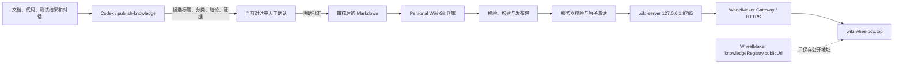

> 摘要：本页维护 Knowledge Registry 个人知识库的整体架构、WheelMaker 配置接入、服务器部署运维、文档导入审核和 Git 发布流程。

# Knowledge Registry：WheelMaker 接入、服务器运维与知识管理

Knowledge Registry 是一个独立于具体工程的个人知识库。它把经过确认的长期知识保存为 Markdown，使用 Git 记录历史，通过构建生成只读网页，再由密码保护的服务发布到 `https://wiki.wheelbox.top`。

核心原则是：**原始材料不是知识，只有经过整理、确认、验证和版本化的结论才进入知识库。** WheelMaker 提供知识库地址和对话入口，Personal Wiki 独立仓库负责内容、构建与发布，服务器只负责安全读取和原子切换版本。

## 整体架构



各组件的职责如下：

| 组件 | 职责 | 不负责的内容 |
| --- | --- | --- |
| WheelMaker | 保存 Knowledge Registry 的公开地址，承载产生和确认知识的对话 | 不保存 Wiki 密码，不充当知识源，不代理 Personal Wiki 的 Git 操作 |
| `publish-knowledge` skill | 盘点材料、提议候选知识、执行获批后的整理和发布流程 | 不替用户批准内容，不把对话原文直接写入 Wiki |
| Personal Wiki 仓库 | 保存审核后的 Markdown、目录、附件、构建器、认证服务和部署脚本 | 不保存原始资料库、草稿队列和任何凭据 |
| Git | 保存当前知识和完整变更历史 | 不代替内容审核 |
| `wiki-server` | 密码认证、会话管理和受保护的静态文件读取 | 不编辑知识，不直接面向公网监听 |
| WheelMaker Gateway | 为 `wiki.wheelbox.top` 提供公网入口、TLS 和反向代理 | 不读取密码，不直接暴露静态发布目录 |
| DNS | 把 `wiki.wheelbox.top` 解析到服务器公网地址 | 不存放网页、证书或知识内容 |

## 仓库与配置所有权

### Personal Wiki 定位配置

Codex 通过用户级配置 `~/.codex/personal-wiki.json` 定位独立知识库：

```json
{
  "repositoryPath": "D:/path/to/personal-wiki",
  "remote": "origin",
  "defaultBranch": "main",
  "publicUrl": "https://wiki.wheelbox.top"
}
```

该文件只保存路径、远端名、默认分支和公开地址，不得保存密码、Token、私钥或会话数据。`remote` 字段只是预期远端名称；实际仓库仍必须正确配置对应 Git remote 和认证。

Personal Wiki 仓库的核心结构是：

```text
personal-wiki/
├─ content/                    # 唯一知识源，按主题保存 Markdown
│  ├─ sections.json           # 顶层分类和顺序
│  └─ <section>/*.md          # 审核后的知识文章
├─ attachments/               # 仅保存明确批准的附件
├─ app/                       # React 阅读界面
├─ server/                    # Go 密码保护服务
├─ scripts/                   # 内容检查、构建和发布
├─ ops/                       # systemd、激活脚本和 Gateway 路由
├─ .github/workflows/         # main 分支自动发布工作流
└─ .wiki-out/                 # 本地生成物，不提交、不手工编辑
```

`content/**/*.md` 是知识的唯一事实源。网页 JSON、搜索索引、HTML、JavaScript 和发布包全部是可重新生成的产物。

### WheelMaker 配置接入

WheelMaker 顶层 `config.json` 支持独立的非敏感定位配置：

```json
{
  "knowledgeRegistry": {
    "publicUrl": "https://wiki.wheelbox.top"
  }
}
```

必须区分两个名称相近但职责不同的配置：

- `registry`：WheelMaker Conversation Registry，负责 App、Hub、Session 和 WebSocket 通信。
- `knowledgeRegistry`：Personal Wiki 地址定位器，只包含 `publicUrl`。

Go 共享配置层使用严格 JSON 解码。`knowledgeRegistry` 目前只允许 `publicUrl`；在该 section 中加入 `password`、`token` 或其他未知字段会导致配置解析失败。运行中的 WheelMaker 二进制必须已经包含该字段后，才能把它写入真实 `~/.wheelmaker/config.json`，否则旧版本的严格解析器会把它当作未知字段拒绝启动。

当前接入边界是“配置可解析并保留公开地址”。Workspace Web 还没有消费该字段形成菜单或内嵌页面；后续若增加入口，应由服务端以受控、只读方式投影公开地址，不能把配置文件或 Wiki 凭据发送给浏览器。

Knowledge Registry 仍是独立站点。日常新增知识不需要修改 WheelMaker 代码，也不需要重新发布 WheelMaker；只有 WheelMaker 自身的入口、配置合同或 Gateway 能力变化时才涉及 WheelMaker 发布。

## 知识分类与文章模型

目录按未来检索问题的主题组织，不按工程名组织。当前顶层分类是：

1. `Unity`：BRG、渲染架构、资源管线、性能分析和平台构建。
2. `Unreal Engine`：Shader、Niagara、VT、渲染、资产管线和性能分析。
3. `软件开发`：不依赖具体引擎的代码、测试、工具和工程结论。
4. `系统与运维`：服务器、网络、发布和运行时治理。
5. `AI 与工作流`：AI 协作、知识沉淀和可重复流程。
6. `产品与决策`：已确认的方向、权衡和决策依据。
7. `个人方法`：跨工程适用的原则、检查表和思考框架。

Unity 和 Unreal Engine 先在顶层分开，同一引擎内部再用文章标题和标签区分渲染、场景、资产、UI、Shader、特效、构建和性能等主题。项目名只写入文章的 `projects` 元数据，不能成为顶层目录。

每篇文章必须具有稳定 ID、明确标题、一句话摘要、分类、排序、标签、当前状态、更新时间、置信度、关联项目和可追溯来源。文章正文先给出当前结论，再说明适用范围、约束、证据和操作含义。旧结论不在正文中保留副本，历史由 Git 负责。

置信度使用三档：

- `verified`：由代码、测试或实际运行结果验证。
- `confirmed`：已经明确决定，但不一定有自动验证。
- `provisional`：明确批准的短期结论，需要尽快验证或删除。

来源必须是具体仓库版本、文档标题或链接、带日期的决定、验证结果之一，不能写“根据记忆”一类无法追溯的描述。

## 文档和对话进入知识库的流程

### 1. 盘点原始材料

文档导入每批处理 5 到 15 份，先建立清单，再进行内容整理。盘点至少包括：

- 文件名、格式、大小、修改时间和内容哈希；
- 完全重复和语义重复资料；
- 文档主题、引擎归属和可能的目标分类；
- 密码、Token、私钥、内部链接、人员信息和其他敏感内容；
- 资料是稳定知识、测试证据、原始记录还是已经过时的说明。

PDF、PPTX 和 DOCX 不能只提取文字，还要检查页面或幻灯片的视觉内容，避免漏掉表格、图示和截图。RDC、视频、Profiler Capture 等大文件默认视为原始证据，不直接成为 Wiki 文章；只有其中可验证、可独立说明的结论才被提炼。

原始资料默认保留在原目录，不复制到 Wiki 仓库。只有文章确实需要并且用户明确批准时，才把允许格式的附件放入 `attachments/`。

### 2. 清洗和归并

Agent 把原始材料整理成少量可复用文章，而不是“一份文档对应一篇页面”。整理时应：

- 合并重复主题，已有稳定主题优先更新现有文章；
- 删除内部人员、私有目录、临时链接和无关项目细节；
- 区分事实、测试条件、推论和未解决问题；
- 性能结论保留设备、场景、规模、版本、指标和瓶颈条件；
- 对相互矛盾的资料保留证据差异，不静默选择其中一份；
- 排除破解软件说明、凭据、会话原文和无法验证的猜测。

### 3. 在对话中提出候选知识

写入前必须展示精确候选清单。每个候选至少包含：

1. 稳定工作标题；
2. 目标分类；
3. 一句话结论；
4. 置信度和证据；
5. 新建文章还是更新现有文章。

这一步只做提案，不修改 Personal Wiki 文件、不创建 Wiki commit、不推送。审核发生在当前对话中，Wiki 页面不建立 Inbox、Draft、Review Queue 或审批界面。

### 4. 明确批准

只有用户在当前对话明确批准精确候选项后才能写入，例如：

```text
批准发布以上全部候选知识
```

或者：

```text
批准发布第 1、3、5 条
```

沉默、一般性的“继续”、其他对话里的批准、底层代码改动获批，都不能替代知识发布批准。候选内容发生实质变化时必须重新确认。

### 5. 写入审核后的 Markdown

获批后才读取 Personal Wiki 的 `AGENTS.md`、`content/sections.json`、文章合同和相关现有文章。写入时：

- 保留任务开始前的无关工作树改动；目标文章存在重叠修改时停止；
- 主题已存在时更新原文，不制造“v2”“新版”“归档版”等平行页面；
- 填写精确范围、置信度、更新日期和来源；
- 不使用原始 HTML；
- Wiki 内部文章链接使用稳定文章 ID；
- 不写密码、Token、私钥、访问码、Session 数据或原始对话；
- 不创建 `conversations/`、`drafts/`、`inbox/`、`raw/`、`scratch/`、`sources/` 等原始材料目录。

### 6. 校验、提交和发布

内容写入后从 Personal Wiki 仓库根目录执行：

```powershell
npm run check
npx tsc --noEmit
npm test
```

其中：

- `npm run check` 校验文章 schema、ID、标题、分类、链接、附件、来源和敏感信息；
- TypeScript 检查保证阅读界面仍能编译；
- `npm test` 同时运行内容测试和 Go 认证服务测试。

全部通过后只暂存获批的 Wiki 文件，提交一个聚焦的知识 commit。正式发布前再次同步默认分支；发生语义冲突时停止并由用户决定，不强行选择结论。

## 构建与发布模型

### 构建产物

```powershell
npm run build
```

构建流程会：

1. 清理旧的 `.wiki-out/site`；
2. 读取并验证 Markdown 和 `sections.json`；
3. 生成文章 JSON、目录和搜索索引；
4. 用 webpack 生成静态阅读界面；
5. 把源 Git commit 写入 release metadata；
6. 为全部发布文件生成大小和 SHA-256 manifest；
7. 生成带时间戳和源 commit 的 release ID。

`.wiki-out/` 是生成目录，不得手工修改或提交。发布必须来自已经提交且工作树干净的 Git revision，避免线上版本无法追溯。

### GitHub Actions 自动发布

Personal Wiki 的 `main` 分支 push 会触发私有仓库中的 `publish.yml`：

1. checkout 获批知识源；
2. 安装锁定的 Node 和 Go 环境；
3. 执行测试；
4. 从 GitHub Secrets 写入临时 SSH identity 和独立 known-hosts 文件；
5. 执行 `npm run publish`。

所需 Secrets 只存在 GitHub 仓库设置中，包括部署主机、端口、私钥和 pinned known-hosts。它们不得进入 Git、WheelMaker 配置、Personal Wiki 内容或日志。只有 Personal Wiki 仓库实际配置了 Git remote、Secrets 和服务器授权公钥后，push-to-main 自动发布链路才算完整启用。

### 本地手动发布

自动发布不可用时，可以使用同一实现从干净仓库手动发布：

```powershell
$env:WIKI_DEPLOY_HOST = "<server-host>"
$env:WIKI_DEPLOY_PORT = "22"
$env:WIKI_DEPLOY_USER = "wiki"
$env:WIKI_DEPLOY_IDENTITY = "<private-key-path>"
$env:WIKI_SSH_KNOWN_HOSTS_FILE = "<pinned-known-hosts-path>"
npm run publish
```

脚本强制 `BatchMode=yes`、`StrictHostKeyChecking=yes` 和独立 known-hosts 文件。认证或网络失败时不能通过关闭主机校验、改用明文传输或放宽 SSH 安全配置继续。

## 服务器部署和访问链路

### 网络路径

```text
浏览器
  → DNS: wiki.wheelbox.top
  → HTTPS / TLS
  → WheelMaker Gateway
  → reverse_proxy 127.0.0.1:9765
  → wiki-server
  → /srv/personal-wiki/current
```

DNS 的作用只是让域名解析到服务器公网地址。Gateway 使用域名匹配请求，并通过 Caddy 的 ACME 流程申请和续期公开可信的 TLS 证书。证书使浏览器能够验证服务器身份并加密 HTTP 流量；HTTP 到 HTTPS 跳转保证用户最终使用加密连接。

自动证书要求：

- `wiki.wheelbox.top` 的 DNS 指向正确服务器；
- 公网 80/443 端口可达；
- 云安全组、防火墙和 NAT 没有拦截；
- 同一 hostname 没有被另一个 Gateway 站点声明占用。

Knowledge Registry 内容更新不需要修改 WheelMaker 业务代码，也不需要每次重新申请证书。Gateway 路由和证书只建立一次，后续仍代理到同一个 loopback 服务。

### 首次服务器安装

首次 provision 由 root 执行，并需要三份输入：Linux `wiki-server` 二进制、部署公钥和 Argon2id 密码哈希文件。安装脚本会：

- 创建无普通登录用途的系统用户 `wiki`；
- 创建 `/srv/personal-wiki/releases`、`/etc/personal-wiki` 和受限 SSH 目录；
- 安装 `/usr/local/bin/wiki-server`；
- 安装 `/usr/local/bin/personal-wiki-activate`；
- 安装并启用 `personal-wiki.service`；
- 以 `0600` 权限保存密码哈希；
- 为部署公钥添加禁止端口转发、Agent 转发、X11 和 PTY 的限制。

密码原文不会保存到仓库或 WheelMaker 配置。服务使用 Argon2id 哈希验证密码；密码哈希文件对 group 和 others 不可读。

### 服务运行边界

systemd 服务以 `wiki` 用户运行，只监听 `127.0.0.1:9765`。公网无法绕过 Gateway 直接连接该端口。服务使用只读站点目录，并启用 systemd 的 `NoNewPrivileges`、`ProtectSystem`、`ProtectHome`、私有临时目录、设备隔离和 syscall/namespace 限制。

登录和读取行为：

- 未登录访问页面会跳转到 `/login`；
- 未登录直接请求 `/data/`、`/attachments/` 或 `/assets/` 返回 401；
- 密码连续失败达到 5 次后，同一客户端在 15 分钟窗口内被限流；
- 登录成功后使用 `HttpOnly`、`Secure`、`SameSite=Strict` Cookie；
- Session 默认有效期为 12 小时，只在服务内存中保存，服务重启后全部失效；
- `/logout` 只接受 POST，并立即删除当前 Session；
- CSP、禁止 iframe、`no-referrer`、`nosniff` 和 `noindex` 等 Header 默认开启。

`noindex` 只能阻止正常搜索引擎收录，不能代替密码认证。真正的访问控制来自 `wiki-server`。

### 日常服务器检查

在服务器上使用：

```bash
systemctl status personal-wiki
journalctl -u personal-wiki --since today
curl --fail http://127.0.0.1:9765/healthz
readlink -f /srv/personal-wiki/current
```

`/healthz` 只检查当前目录中的入口、目录数据和 release manifest 是否存在，不返回知识内容。公网还应单独检查 `https://wiki.wheelbox.top` 的证书、状态码和登录页。

### 原子发布与回滚

`npm run publish` 先构建 `site/` 包，计算整个压缩包 SHA-256，再上传到固定格式的 `/tmp/personal-wiki-<release-id>.tgz`。服务器激活脚本随后：

1. 获取部署锁，避免两个发布同时切换；
2. 验证压缩包 SHA-256；
3. 拒绝 `site/` 以外、绝对路径、父目录跳转和反斜杠路径；
4. 解压到私有 candidate 目录；
5. 使用 `wiki-server verify-root` 验证 release manifest、文件大小、SHA-256、必需文件和未登记文件；
6. 把 candidate 移到正式 release 目录；
7. 原子切换 `/srv/personal-wiki/current` 符号链接；
8. 连续检查 loopback `/healthz`；
9. 健康检查失败时恢复 previous symlink；
10. 成功后删除上传包，并清理过旧 release，同时保护当前和前一个版本。

因此发布失败不会留下半成品站点；部署失败后服务器继续保留上一份有效版本。

### 静态内容发布与服务二进制发布

必须区分两种变更：

- 文章、目录、搜索、React 阅读界面变化：走正常 `npm run publish`，只切换静态 release。
- 登录页、密码算法、Cookie、安全 Header、限流或 `wiki-server` 行为变化：重新编译 Linux `wiki-server`，安全替换 `/usr/local/bin/wiki-server`，执行 daemon reload（Unit 变化时）并重启 `personal-wiki.service`。

普通静态发布不会替换正在运行的 Go 二进制。若只发布前端改名而没有部署新二进制，登录页仍可能显示旧品牌，但登录后的静态界面已经更新。

## 日常知识管理操作

### 从一批文档开始

在任何 WheelMaker/Codex 对话中提供资料目录，并明确先盘点、不要直接发布：

```text
盘点这个目录中的文档，按 Unity、Unreal Engine 和通用知识分类，识别重复与敏感内容，先给我候选文章，不要写入 Wiki。
```

确认候选后再回复精确批准范围。Agent 会定位 Personal Wiki、同步默认分支、写入获批文章、运行检查、提交、同步并推送。

### 从一次代码任务或问答沉淀知识

任务结束后，只提议满足以下条件的结论：

- 跨任务和跨对话仍有价值；
- 离开当前对话也能独立理解；
- 已由代码、测试、文档、决定或验证结果支持；
- 有清晰适用范围，不把项目特例冒充通用规律；
- 不与现有文章重复。

临时状态、未解决问题、猜测、一次性 workaround 和流水账不进入 Wiki。用户批准的是“知识候选”，不是整个开发任务；开发任务获批不自动等于知识发布获批。

### 修改已有知识

稳定主题已经存在时，更新原文章并保留当前正确结论。不要在 Wiki 中保留多个相互冲突的历史版本，也不要复制整篇文章作为新版；Git commit 和 diff 是历史记录。

当新证据推翻旧结论时，候选提案必须说明：

- 旧结论为什么不再适用；
- 新证据和适用范围；
- 将改写哪些段落；
- 置信度是否变化。

### 故障处理边界

- 内容校验失败：保持 Wiki 未提交，修复具体文章和规则。
- 检测到秘密：从暂存区和生成物中移除，不在回复或日志中复述秘密。
- Git 语义冲突：停止并请求用户选择，不静默合并不同知识结论。
- push 成功但部署失败：保留 commit，服务器继续使用上一份原子 release。
- SSH、TLS 或主机校验失败：修复认证和网络，不降低验证强度。
- 原始资料损坏或来源不足：保留为证据或待确认项，不生成“可靠知识”。

## 运维与安全检查表

### 每次知识发布

- 候选标题、分类、结论、置信度、来源和修改方式已经展示。
- 用户在当前对话明确批准精确候选。
- 没有密码、Token、私钥、Session、内部人员或原始对话。
- 现有主题优先更新，没有制造重复文章。
- Unity 和 Unreal Engine 分类正确，项目名只在元数据中。
- `npm run check`、`npx tsc --noEmit`、`npm test` 全部通过。
- commit 聚焦且来源可追溯。
- push、Actions 和服务器激活结果已确认。

### 服务器例行检查

- DNS 仍解析到正确入口。
- HTTPS 证书有效，HTTP 正确跳转到 HTTPS。
- Gateway 和 `personal-wiki.service` 正常。
- loopback healthz 和公网登录页均正常。
- 当前 release symlink 指向有效目录。
- 磁盘空间、systemd 日志和旧 release 数量正常。
- 部署账户仍使用受限公钥，未改为明文密码自动化。
- 密码哈希、SSH 私钥和 GitHub Secrets 没有进入仓库。

## 相关实现与文档

WheelMaker 仓库：

- [`../architecture/gateway.md`](../architecture/gateway.md)：Gateway、TLS、站点声明和公网入口边界。
- [`../architecture/server-runtime.md`](../architecture/server-runtime.md)：WheelMaker 顶层配置所有权和 `knowledgeRegistry.publicUrl`。
- [`../../../server/config.example.json`](../../../server/config.example.json)：WheelMaker 配置示例。
- [`../../../server/internal/shared/config.go`](../../../server/internal/shared/config.go)：`KnowledgeRegistryConfig` 严格解析实现。

Personal Wiki 独立仓库：

- `README.md`、`AGENTS.md`：仓库边界和基本工作流。
- `content/sections.json`：当前主题分类。
- `scripts/publish-wiki.mjs`、`scripts/lib/content.mjs`：检查、构建、manifest 和 SSH 发布。
- `server/internal/wiki/`：Argon2id、Session、限流、安全 Header 和 release 校验。
- `ops/provision.sh`、`ops/activate-release.sh`、`ops/personal-wiki.service`、`ops/wiki.caddy`：安装、原子激活、systemd 沙箱和 Gateway 路由。
- `.github/workflows/publish.yml`：私有仓库的 push-to-main 自动发布。

用户级知识发布合同：

- `~/.codex/skills/publish-knowledge/SKILL.md`
- `~/.codex/skills/publish-knowledge/references/article-contract.md`
